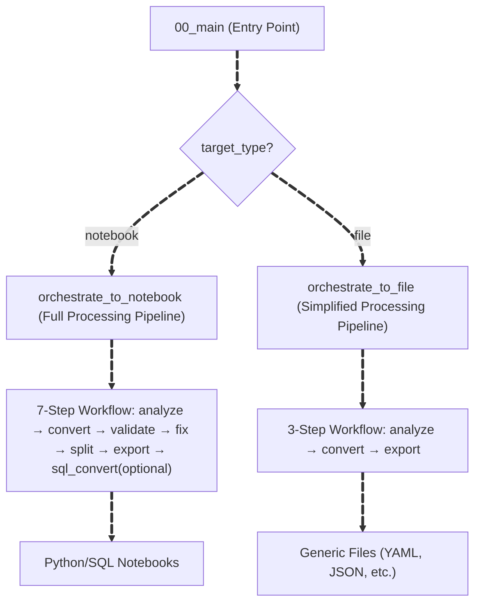
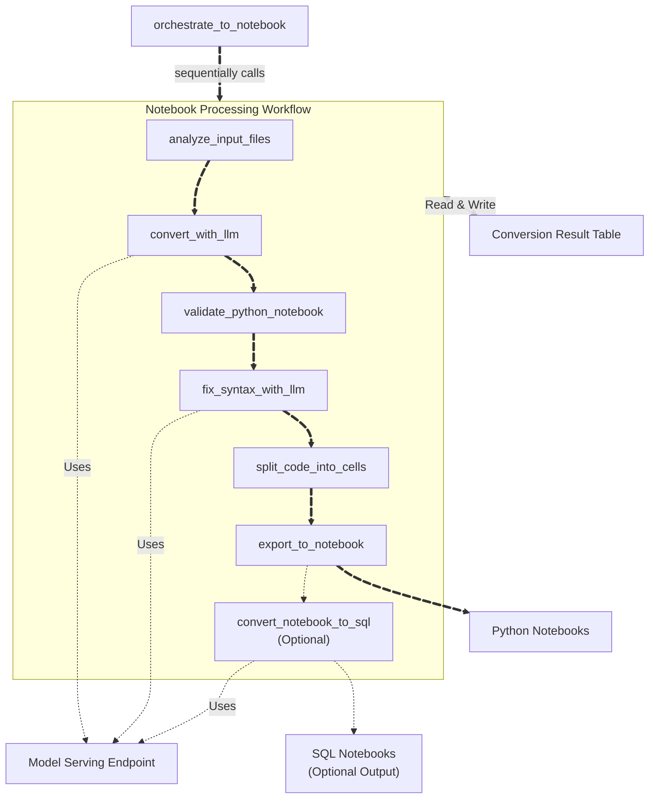
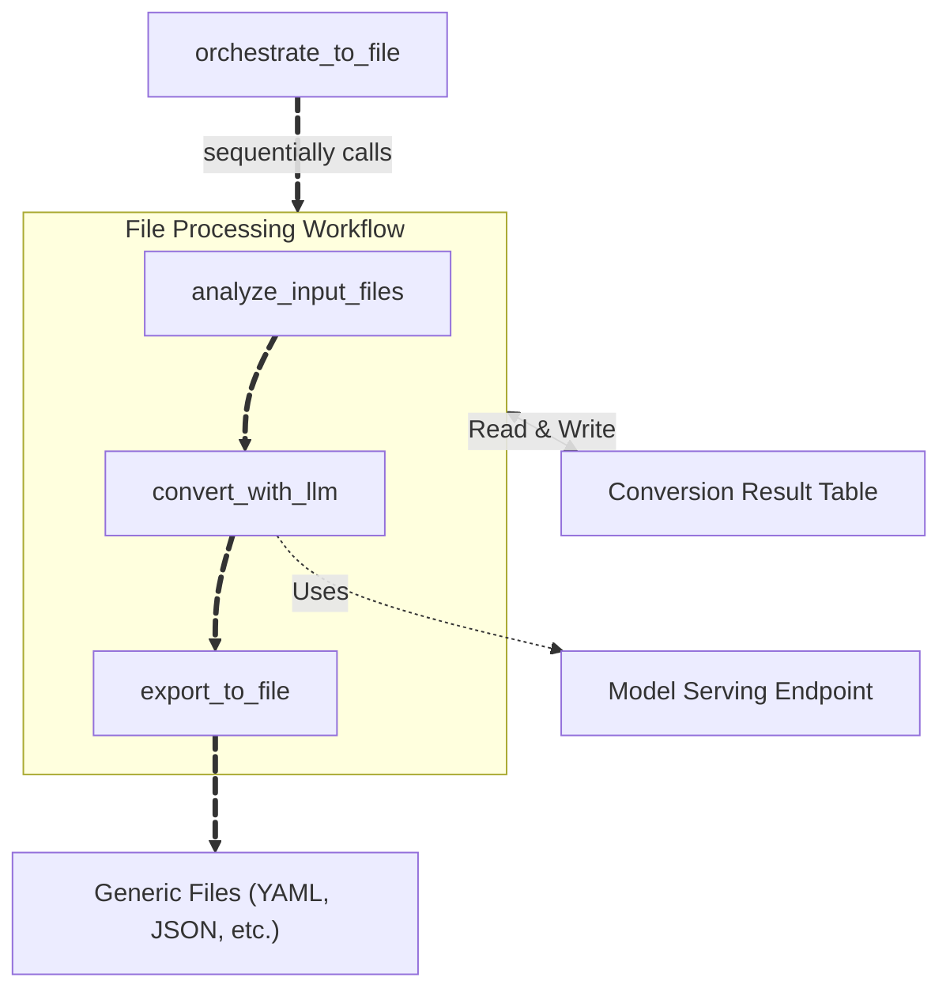

import CodeBlock from '@theme/CodeBlock';

**Switch** is a Lakebridge transpiler plugin that uses Large Language Models (LLMs) to convert SQL and other source formats into Databricks notebooks or generic files. Switch leverages [Mosaic AI Model Serving](https://docs.databricks.com/aws/en/machine-learning/model-serving/) to understand code intent and semantics, generating equivalent Python notebooks with Spark SQL or other target formats.

This LLM-powered approach excels at converting complex stored procedures, business logic, and ETL workflows where context and intent matter more than syntactic transformation. While generated notebooks may require manual adjustments, they provide a valuable foundation for Databricks migration.

---

## How Switch Works

Switch operates through three key components that distinguish it from rule-based transpilers:

### LLM-Powered Semantic Understanding
Instead of parsing rules, Switch uses [Mosaic AI Model Serving](https://docs.databricks.com/aws/en/machine-learning/model-serving/) to:
- Interpret code intent and business context beyond syntax
- Handle SQL dialects, programming languages, and workflow definitions
- Support complex logic patterns and proprietary extensions
- Enable extensible conversion through custom YAML prompts

### Native Databricks Integration
Switch runs entirely within the Databricks workspace:
- **Jobs API**: Executes as scalable Databricks Jobs for batch processing
- **Model Serving**: Direct integration with Databricks LLM endpoints, with concurrent processing for multiple files
- **Delta Tables**: Tracks conversion progress and results

### Flexible Output Formats
- **Notebooks**: Python notebooks containing Spark SQL (primary output)
- **Generic Files**: YAML workflows, JSON configurations, and other text formats
- **Experimental**: Additional SQL notebook output converted from generated Python notebooks

---

## Prerequisites & Requirements

Before installing and using Switch, ensure your Databricks environment meets these requirements:

### Databricks Workspace Setup

**Job Execution Environment**
- **Job Creation Permission**: Ability to create and manage Databricks Jobs
  - A Switch job is automatically created during `install-transpile` execution
- **Compute Access**: Switch creates jobs using serverless job compute by default
  - If serverless is unavailable, you can modify job configuration in the Databricks workspace to use classic job compute

**Data Storage Requirements**
- **Catalog Access**: Existing catalog for Switch state management tables
  - Unity Catalog catalogs (recommended) or Hive metastore catalogs supported
- **Schema Access**: Existing schema within the specified catalog
- **Table Creation Permission**: `CREATE TABLE` rights on the catalog and schema
  - Switch creates Delta tables for conversion state and intermediate results
  - Table naming: `lakebridge_switch_{timestamp}_{random}` (e.g., `lakebridge_switch_20250115143022_7ka9`)

### Model Serving Access

Switch uses Foundation Model APIs (like Claude) by default, with options for external model endpoints:

- **Default Setup**: Uses Foundation Model API endpoints - no additional configuration required
- **Permissions Required**: Query access to the model serving endpoint being used
- **Custom Options**: Optionally configure external model endpoints or Provisioned Throughput for higher capacity

### Databricks Runtime (for Classic Job Compute)
- **Default**: Serverless job compute (no runtime configuration required)
- **Classic Job Compute**: If using classic clusters instead of serverless:
  - **Verified Versions**: DBR 14.3 LTS or 15.3 LTS (higher versions likely compatible)
  - **Compute Type**: Single-node clusters recommended (Photon not required)

---

## Source Format Support

Switch supports multiple source formats and provides built-in conversion prompts for various use cases.

**Usage**: Specify the conversion type using the `--source-dialect` parameter with one of the values listed below.

### SQL Sources (Default)

Convert SQL from various dialects to Databricks Python notebooks with automatic comment removal and whitespace normalization.

#### Built-in SQL Dialect Prompts

| `--source-dialect` Value | Source Systems |
|-------------|----------------|
| `mysql` | MySQL, MariaDB, and MySQL-compatible services (including Amazon Aurora MySQL, RDS, Google Cloud SQL) |
| `netezza` | IBM Netezza |
| `oracle` | Oracle Database, Oracle Exadata, and Oracle-compatible services (including Amazon RDS) |
| `postgresql` | PostgreSQL and PostgreSQL-compatible services (including Amazon Aurora PostgreSQL, RDS, Google Cloud SQL) |
| `redshift` | Amazon Redshift |
| `snowflake` | Snowflake |
| `teradata` | Teradata |
| `tsql` | Microsoft SQL Server, Azure SQL family (Database, Managed Instance, Synapse Analytics), Amazon RDS for SQL Server |

### Generic Sources

Convert non-SQL files to notebooks or other formats without preprocessing.

#### Built-in Generic Prompts

| `--source-dialect` Value | Source → Target |
|--------------|-----------------|
| `python` | Python Script → Databricks Python Notebook |
| `scala` | Scala Code → Databricks Python Notebook |
| `airflow` | Airflow DAG → Databricks Jobs YAML + Operator conversion guidance (SQL→sql_task, Python→notebook, etc.) |

### Custom Prompt Support

Switch's LLM-based architecture supports additional conversion types through custom YAML conversion prompts, making it extensible beyond built-in options.

For custom prompt creation, see the [Customizable Prompts](#customizable-prompts) section.

---

## Installation & Usage

### Installation

Switch integrates with the Lakebridge transpiler ecosystem:

```bash
databricks labs lakebridge install-transpile
```

The installation automatically:

1. **Installs Switch**: Alongside other transpilers
2. **Creates Databricks Job**: In your authenticated workspace  
3. **Uploads Notebooks**: Switch processing notebooks to workspace

Configuration is saved to:
- **macOS/Linux**: `~/.databricks/labs/remorph-transpilers/switch/lib/config.yml`
- **Windows**: `%USERPROFILE%\.databricks\labs\remorph-transpilers\switch\lib\config.yml`

### CLI Usage

Use the following command to run Switch. Specifying the Switch config file with `--transpiler-config-path` tells Lakebridge to use Switch as the transpiler. Add `--output json` for structured output with job monitoring details:

```bash
# Switch usage - SQL to notebooks conversion
databricks labs lakebridge transpile \
  --transpiler-config-path ~/.databricks/labs/remorph-transpilers/switch/lib/config.yml \
  --input-source /Workspace/path/to/sql \
  --output-folder /Workspace/path/to/notebooks \
  --source-dialect snowflake \
  --catalog-name your_existing_catalog \
  --schema-name your_existing_schema \
  --output json
```

When executing the above command, the response will look like this:

```json
{
  "transpiler": "switch",
  "job_id": 12345,
  "run_id": 67890,
  "run_url": "https://your-workspace.databricks.com/#job/12345/run/67890"
}
```

For advanced configuration and conversion options (non-SQL sources, file outputs, etc.), see the [Advanced Configuration](#advanced-configuration) section below.

#### Operational Notes

Switch operates differently from other Lakebridge transpilers:

- **Databricks Workspace Paths Required**: Input and output paths must be workspace paths (e.g., `/Workspace/path/to/...`) rather than local file paths
- **Jobs API Execution**: Switch runs as a Databricks Job in your workspace, not as a local process
- **Asynchronous by Default**: The command returns immediately with a job URL, allowing you to monitor progress in the Databricks workspace
- **Monitoring**: Use the returned job URL to track conversion progress and view logs

### CLI Parameters

#### Required Parameters
- `--transpiler-config-path` - Local path to Switch configuration file (identifies Switch as the transpiler)
- `--input-source` - Databricks workspace path(s) or Unity Catalog Volume path(s) containing files to convert (see Input Source Patterns below)
- `--output-folder` - Databricks workspace path for generated outputs
- `--source-dialect` - Conversion type to use. Choose from:
  - **SQL Dialects**: `mysql`, `snowflake`, `oracle`, `postgresql`, `redshift`, `teradata`, `netezza`, `tsql`
  - **Generic sources**: `python`, `scala`, `airflow`
- `--catalog-name` - Databricks catalog for state tables. Must already exist.
- `--schema-name` - Databricks schema for state tables. Must already exist.
  - Note: The user must have `CREATE TABLE` permissions on the specified catalog and schema for Switch's state management and intermediate result tables.

#### Input Source Patterns

The `--input-source` parameter supports flexible path specifications:

| Pattern Type | Example | Description |
|-------------|---------|-------------|
| **Single Directory** | `/Workspace/path/to/sql` | Process all files in specified directory recursively |
| **Multiple Directories** | `/Workspace/project1/sql,/Workspace/project2/sql` | Process files from multiple directories recursively (comma-separated) |
| **Glob Patterns** | `/Workspace/Users/*/sql/*.sql` | Use wildcards to match paths (`*` = any characters, `**` = recursive) |
| **Mixed Patterns** | `/Workspace/prod/**/*.sql,/Workspace/dev/sql` | Combine different pattern types |

### Advanced Configuration

Switch provides detailed configuration options that can be set by editing the `config.yml` file:

| Parameter | Description | Default Value | Available Options |
|-----------|-------------|---------------|-------------------|
| `endpoint_name` | Model serving endpoint name | `databricks-claude-sonnet-4` | Any valid endpoint name |
| `token_count_threshold` | Maximum tokens per file for processing | `20000` | Any positive integer |
| `concurrency` | Number of parallel LLM requests | `4` | Any positive integer |
| `comment_lang` | Language for generated comments | `English` | `English`, `Japanese`, `Chinese`, `French`, `German`, `Italian`, `Korean`, `Portuguese`, `Spanish` |
| `max_fix_attempts` | Maximum syntax error fix attempts | `1` | 0 or any positive integer |
| `log_level` | Logging verbosity level | `INFO` | `DEBUG`, `INFO`, `WARNING`, `ERROR` |
| `source_format` | Source file format type. `sql` performs SQL comment removal and whitespace compression preprocessing. `generic` processes files as-is without preprocessing. | `sql` | `sql`, `generic` |
| `target_type` | Output format type | `notebook` | `notebook`, `file` |
| `output_extension` | File extension for file output | `<none>` | Any extension (e.g., `.yml`, `.json`) |
| `conversion_prompt_yaml` | Custom conversion prompt YAML file path. When specified, this custom prompt is used instead of the built-in prompt for the selected `--source-dialect` | `<none>` | Full workspace path to YAML file |
| `request_params` | Additional request parameters for model serving endpoint | `<none>` | JSON format string (e.g., `{"max_tokens": 64000}`) |
| `sql_output_dir` | (Experimental) Directory for SQL notebooks | `<none>` | Full workspace path |
| `wait_for_completion` | Wait for job completion. `true`=waits until job finishes, `false`=returns immediately with job URL | `false` | `true`, `false` |

### How to Configure

Modify `default:` values in the `config.yml` file and then execute `databricks labs lakebridge transpile`

**Example config.yml modification**:
```yaml
- flag: comment_lang
  default: "Japanese"     # Change from default "English" to "Japanese"
```

**Configuration for specific conversions**:
- **Python script → Databricks Python notebook**: Set `source_format: "generic"`
- **Airflow → Databricks Jobs YAML**: Set `source_format: "generic"`, `target_type: "file"`, `output_extension: ".yml"`

---

## Transpiler Selection Guide

Lakebridge offers both LLM-powered and rule-based transpilers, each optimized for different conversion scenarios.

### LLM-Powered Conversion (Switch)

Switch is best suited for scenarios requiring semantic understanding and flexibility:
- **Complex logic requiring contextual understanding** - Stored procedures and business logic where intent matters more than syntax
- **Source formats not covered by rule-based transpilers** - Any SQL dialect or programming language through custom prompts
- **Extensible conversion through custom YAML prompts** - Adapt to proprietary or uncommon source formats
- **Python notebook output for SQL beyond ANSI SQL/PSM standards** - Complex transformations that benefit from procedural code

### Rule-Based Conversion (BladeBridge & Morpheus)

Rule-based transpilers excel in scenarios requiring consistency and speed:
- **Deterministic output with guaranteed syntax equivalence** - Every conversion produces the same predictable result
- **High-volume batch processing** - Efficiently handle thousands of files without API rate limits
- **Fast local execution without API dependencies** - Sub-minute processing with no external service calls
- **Production-grade SQL aligned with Databricks SQL evolution** - Leverages SQL Scripting, Stored Procedures, and latest DBSQL features

### Key Decision Factors

Consider these aspects when choosing between transpilers:
- **Complexity**: Switch excels at complex logic requiring contextual understanding; rule-based transpilers handle standard SQL patterns efficiently
- **Volume**: Rule-based transpilers process large volumes quickly; Switch is better for selective, complex conversions
- **Customization**: Switch adapts to any source format through prompts; rule-based transpilers support specific, well-defined dialects
- **Output format**: Switch primarily generates Python notebooks; rule-based transpilers produce SQL files

### Best Practices for Switch

When using Switch, follow these guidelines for optimal results:
1. **Start with representative sample files** - Test conversion quality before processing entire codebase
2. **Iteratively refine prompts based on results** - Adjust YAML prompts to improve accuracy for your specific patterns
3. **Review generated code before production use** - LLM outputs may require manual adjustments
4. **Document successful patterns for future reference** - Keep track of effective prompts and configurations for reuse

---

## Databricks Implementation Details

When you run Switch via the CLI, it executes as Databricks Jobs using a sophisticated multi-stage processing pipeline. This section covers the internal architecture and configuration options.

## Processing Architecture

Switch executes as a Databricks Job that runs the main orchestration notebook (`00_main`), which routes to specialized orchestrators that coordinate the conversion pipeline:

### Main Orchestration
The **`00_main`** notebook serves as the entry point when Switch is executed via Databricks Jobs API. It:
- Validates all input parameters from the job configuration
- Routes execution to the appropriate orchestrator based on `target_type` (notebook or file output)
- Handles orchestrator results and displays final conversion summary

### Conversion Flow Overview

Switch supports two target types with different processing workflows. The main entry point (`00_main`) routes to the appropriate orchestrator based on the `target_type` parameter:



### Notebook Conversion Flow

For `target_type=notebook`, the `orchestrate_to_notebook` orchestrator executes a comprehensive 7-step processing pipeline:



### File Conversion Flow

For `target_type=file`, the `orchestrate_to_file` orchestrator uses a simplified 3-step processing pipeline optimized for generic file output:



**Key Differences:**
- **File conversion skips** syntax validation, error fixing, and cell splitting steps
- **Direct export** from converted content to specified file format with custom extension
- **Optimized** for non-notebook outputs like YAML workflows, JSON configurations, etc.

## Processing Steps

The following sections describe each processing step used in the workflows above:

### analyze_input_files
Scans the input directory recursively and performs initial analysis. Stores all file contents, metadata, and analysis results in a timestamped Delta table. For SQL sources, creates preprocessed versions with comments removed and whitespace normalized in the table. Counts tokens using model-specific tokenizers (Claude uses ~3.4 characters per token, OpenAI and other models use tiktoken) to determine if files exceed the `token_count_threshold`. Files exceeding the threshold are excluded from conversion.

### convert_with_llm  
Loads conversion prompts (built-in or custom YAML) and sends file content to the configured model serving endpoint. Multiple files are processed concurrently (configurable, default: 4) for efficiency. The LLM transforms source code based on the conversion prompt, preserving business logic while adapting to Databricks patterns. For SQL sources, generates Python code with `spark.sql()` calls. For generic sources, adapts content to the specified target format.

### validate_python_notebook
Performs syntax validation on the generated code. Python syntax is checked using `ast.parse()`, while SQL statements within `spark.sql()` calls are validated using Spark's `EXPLAIN` command. Any errors are recorded in the result table for potential fixing in the next step.

### fix_syntax_with_llm
Attempts automatic error correction when syntax issues are detected. Sends error context back to the model serving endpoint, which suggests corrections. The validation and fix process repeats up to `max_fix_attempts` times (default: 1) until errors are resolved or the retry limit is reached.

### split_code_into_cells
Transforms raw converted Python code into well-structured notebook cells. Analyzes code flow and dependencies, splitting content at logical boundaries like imports, function definitions, and major operations. Adds appropriate markdown cells for documentation and readability.

### export_to_notebook
Creates Databricks-compatible `.py` notebooks in the specified output directory. Each notebook includes proper metadata, source file references, and any syntax check results as comments. Handles large files (up to 10MB) and preserves the original directory structure.

### convert_notebook_to_sql (Optional)
When `sql_output_dir` is specified, this optional step uses the model serving endpoint to convert Python notebooks into SQL notebook format with Databricks SQL syntax. Useful for teams preferring SQL-only workflows, though some Python logic may be lost in the conversion process.

## Parameter Mapping

When Switch executes as a Databricks Job, CLI parameters are mapped to notebook parameters:

| CLI Parameter | Notebook Parameter | Description |
|---------------|-------------------|-------------|
| `--input-source` | `input_dir` | Workspace path(s) containing files to convert (supports patterns) |
| `--output-folder` | `output_dir` | Workspace directory for generated outputs |
| `--catalog-name` | `result_catalog` | Databricks catalog for state tracking tables |
| `--schema-name` | `result_schema` | Databricks schema for state tracking tables |
| `--source-dialect` | `builtin_prompt` | Conversion type (mapped to built-in prompt internally) |
| `--transpiler-config-path` | (config file) | Path to Switch config file (loads additional parameters) |

Additional parameters are configured through the Switch config file (see the [Advanced Configuration](#advanced-configuration) section above).

## State Management

Switch uses a Delta table to track conversion progress and results. Each conversion job creates a timestamped table: `{catalog}.{schema}.lakebridge_switch_{timestamp}_{random}` (e.g., `main.default.lakebridge_switch_20250115143022_7ka9`)

The table stores input file information (path, content, token counts), conversion results (generated notebooks, token usage, processing time), error details when conversions fail, and syntax check results from validation stages. This allows you to monitor which files were processed successfully and investigate any issues that occurred during conversion.

### Conversion Result Table Schema

Switch creates Delta tables with the following complete schema:

| Column | Type | Description |
|--------|------|-------------|
| `input_file_number` | int | Unique integer identifier for each input file (starts from 1) |
| `input_file_path` | string | Full path to the input file |
| `input_file_encoding` | string | Detected encoding of the input file (e.g., UTF-8) |
| `tokenizer_type` | string | Type of tokenizer used (claude or openai) |
| `tokenizer_model` | string | Specific tokenizer model/encoding used |
| `input_file_token_count` | int | Total number of tokens in the input file |
| `input_file_token_count_preprocessed` | int | Token count of preprocessed content (SQL comments removed for SQL files, original count for generic files) |
| `input_file_content` | string | Entire content of the input file |
| `input_file_content_preprocessed` | string | Preprocessed content (SQL comments removed for SQL files, original content for generic files) |
| `is_conversion_target` | boolean | Whether file should be processed (updated during conversion) |
| `model_serving_endpoint_for_conversion` | string | Model endpoint used for conversion |
| `model_serving_endpoint_for_fix` | string | Model endpoint used for syntax error fixing |
| `request_params_for_conversion` | string | Conversion request parameters in JSON format |
| `request_params_for_fix` | string | Fix request parameters in JSON format |
| `result_content` | string | Generated notebook content (initially null) |
| `result_prompt_tokens` | int | Number of prompt tokens used (initially null) |
| `result_completion_tokens` | int | Number of completion tokens generated (initially null) |
| `result_total_tokens` | int | Total tokens used (prompt + completion, initially null) |
| `result_processing_time_seconds` | float | Processing time in seconds (initially null) |
| `result_timestamp` | timestamp | UTC timestamp when processing completed (initially null) |
| `result_error` | string | Any conversion errors encountered (initially null) |
| `result_python_parse_error` | string | Python syntax errors found using ast.parse (initially null) |
| `result_extracted_sqls` | array&lt;string&gt; | SQL statements extracted from Python code (initially null) |
| `result_sql_parse_errors` | array&lt;string&gt; | SQL syntax errors found using EXPLAIN (initially null) |
| `export_output_path` | string | Path to the exported file (initially null) |
| `export_status` | string | Export processing status (initially null) |
| `export_error` | string | Export error information (initially null) |
| `export_timestamp` | timestamp | UTC timestamp when export completed (initially null) |
| `export_content_size_bytes` | long | Size of exported content in bytes (initially null) |

## Model Requirements

### Supported LLM Endpoints

Switch offers flexible model selection - choose any Model Serving endpoint through configuration parameters.

**Default Setup**  
Pre-configured with an latest Claude model via Foundation Model API for immediate use (no configuration required). This ensures strong code comprehension and large context handling out of the box.

**Model Options**  
Switch works with LLMs that have large context windows and strong code comprehension capabilities:

- **Foundation Model APIs**  
  - Pay-per-token pricing for light usage  
  - Provisioned Throughput for high-volume workloads with predictable cost and performance  

- **External Models**  
  - Support for any external model through Model Serving endpoints  
  - Benefits include throughput control, organizational compliance (e.g., Azure-only policies), cost optimization, and higher concurrency limits  

**Advanced Configuration**  
For complex code transformations and intricate business logic, Claude’s extended thinking mode can significantly improve conversion accuracy. This mode allows the model to reason through complex transformations more thoroughly, though it increases processing time and token usage. Configure via `request_params`:

```json
{"max_tokens": 64000, "thinking": {"type": "enabled", "budget_tokens": 16000}}
```

### Token Management

LLMs have limits on how much text they can process at once. Switch uses a configurable threshold approach to ensure stable processing.

**Token Limits and Calculation:**
- **Default threshold**: 20,000 tokens per file
- **Token estimation**: 
  - Claude models: ~3.4 characters per token (20,000 tokens ≈ 68,000 characters)
  - Other models: Uses tiktoken library with o200k_base encoding
- **Preprocessing**: SQL comments removed and whitespace compressed before counting

**Threshold Configuration:**
- **Base configuration**: 20,000 tokens (tested with Claude 3.7 Sonnet, 128k context)
- **Adjustment guidelines**:
  - Complex transformations with extended thinking: Lower threshold (e.g., 8,000 tokens)
  - Larger context models (e.g., Claude Sonnet 4, 200k context): Higher threshold possible

**Handling Oversized Files:**
When files exceed the threshold:
- Automatically excluded during analyze phase
- Marked with status "Not converted"
- Require manual splitting before processing

**File Splitting Strategies:**
If your input files exceed the threshold, consider logical splitting points:
- Separate stored procedures into individual files
- Split by functional modules or business domains
- Maintain referential integrity across split files

### Performance Optimization

**Concurrency Settings:**
- **Default concurrency**: Set to 4 based on testing with Claude models for stable operation
- **Model-specific considerations**: Different foundation models have varying rate limits and optimal concurrency levels
- **Scaling for large workloads**: For processing many files simultaneously, consider:
  - **Increased concurrency**: Test higher values with your chosen model to find optimal settings
  - **Provisioned Throughput**: Deploy dedicated Foundation Model API capacity with guaranteed throughput
  - **External Models**: Configure external endpoints with higher rate limits

**Monitoring:**
- Watch for rate limiting or throttling responses from model endpoints
- Consider enabling [Inference Tables](https://docs.databricks.com/aws/en/machine-learning/model-serving/inference-tables) to automatically capture requests and responses for detailed monitoring and debugging

---

## Customizable Prompts

You can create custom conversion prompts for Switch to handle new SQL dialects or specialized conversion requirements.

### Creating Custom Conversion Prompts

To create a custom conversion prompt:

1. **Create a YAML file** with the required structure
2. **Place it in your Databricks workspace**
3. **Specify the full path** in the `conversion_prompt_yaml` parameter

Custom conversion prompts require two main sections:

#### Required Structure

Here's a simple example showing the basic structure of a custom conversion prompt:

```yaml
system_message: |
  Convert SQL code to Python code that runs on Databricks according to the following instructions:

  # Input and Output
  - Input: A single SQL file containing one or multiple T-SQL statements
  - Output: Python code with Python comments (in {comment_lang}) explaining the code

  ${common_python_instructions_and_guidelines}

  # Additional Instructions
  1. Convert SQL queries to spark.sql() format
  2. Add clear Python comments explaining the code
  3. Use DataFrame operations instead of loops when possible
  4. Handle errors using try-except blocks

few_shots:
- role: user
  content: |
    SELECT name, age
    FROM users
    WHERE active = 1;
- role: assistant
  content: |
    # Get names and ages of active users
    active_users = spark.sql("""
        SELECT name, age
        FROM users
        WHERE active = 1
    """)
    display(active_users)
```

#### Key Elements

**`system_message` Section**:
- Clear explanation of the conversion purpose
- Definition of input and output formats
- Additional instructions for specific conversions
- (Optional) Comment language specification (`{comment_lang}` will be replaced automatically by Switch)
- (Optional) Common instructions placeholder (`${common_python_instructions_and_guidelines}` will be replaced automatically by Switch with built-in conversion guidelines)

**`few_shots` Section** (Optional but recommended):
- Include examples ranging from simple to complex cases
- Each example demonstrates specific patterns for LLM understanding
- Shows typical conversion patterns for your SQL dialect

### Reference: Built-in YAML Files

Switch includes built-in YAML configuration files for supported conversion types, including SQL dialects and other source formats. When creating custom prompts, these built-in configurations serve as excellent starting points - even for supported conversion types, customizing the default prompts based on your specific input patterns can significantly improve conversion accuracy.

**Location**: You can find built-in YAML files in the `switch/resources/builtin_prompts/` directory within the Switch installation. These files demonstrate the proper structure and provide conversion-specific examples that you can adapt for your custom requirements.

### FAQ: Can Switch Support My Source System?

A common question is whether Switch can handle sources beyond the built-in conversion types. The answer is: **try it!**

Switch already supports various source formats including SQL dialects (MySQL, Snowflake, Oracle, etc.), programming languages (Python scripts, Scala code), and workflows (Airflow DAGs).

**For SQL-based sources**: Creating a custom prompt YAML file should work well for most SQL dialects. Since LLMs understand SQL syntax patterns, you can typically achieve good results by:
- Starting with a similar built-in dialect's YAML as a template
- Adding specific syntax examples from your source system
- Testing and iterating based on results

**Tips for efficient prompt creation:**
- **Quick baseline creation**: Feed built-in prompts and your source dialect's representative features to an advanced LLM to quickly generate a baseline YAML configuration
- **Dialect-specific patterns**: Reference open source projects like [SQLGlot dialects](https://github.com/tobymao/sqlglot/tree/main/sqlglot/dialects) for insights into dialect-specific transformation patterns

**For other source formats**: Switch's LLM-based architecture means it can potentially handle various conversions beyond the built-in types. Modern LLMs have strong comprehension capabilities across many languages and formats. You can experiment by:
- Creating custom prompts that define your source format
- Providing clear conversion examples in the few-shots section
- Testing with representative source samples

Rather than waiting for additional built-in examples, we encourage experimentation with custom prompts. The flexibility of LLM-based conversion means many use cases are possible with the right prompt engineering.

## Conversion Results and Troubleshooting

### Understanding Conversion Results

After your Switch job completes, review the conversion results displayed at the end of the `00_main` notebook execution. The results table shows the status of each input file:

- **Successfully converted files**: Ready to use as Databricks notebooks
- **Files requiring attention**: May need manual review or re-processing

If you encounter files that didn't convert successfully, here are the most common issues and their solutions:

### Files Not Converting (Status: `Not converted`)

These files were skipped during the conversion process, typically because they're too large for the model to process effectively.

**Cause**: Input files exceed the token count threshold

**Solutions**:
- Split large input files into smaller, more manageable parts
- Increase the `token_count_threshold` parameter if your LLM model can handle larger inputs

### Conversion with Errors (Status: `Converted with errors`)

These files were successfully processed by the LLM but the generated code contains syntax errors that need to be addressed.

**Cause**: Files were converted but contain syntax errors

**Solutions**:
- Review syntax error messages in the result table's error_details column
- Manually fix errors in the converted notebooks/files
- Increase `max_fix_attempts` for more automatic error correction attempts

### Export Failures (Status: `Export failed` or `Not exported`)

These files were converted successfully but couldn't be exported to the output directory.

**Causes**: 
- Content exceeds 10MB size limit of Databricks notebooks
- File system permissions issues
- Invalid output paths

**Solutions**:
- Check the `export_error` column in the result table for specific error details
- For size issues: Manually split large converted content into smaller units
- For permission issues: Verify workspace access to the output directory
- For path issues: Ensure output directory paths are valid workspace locations
