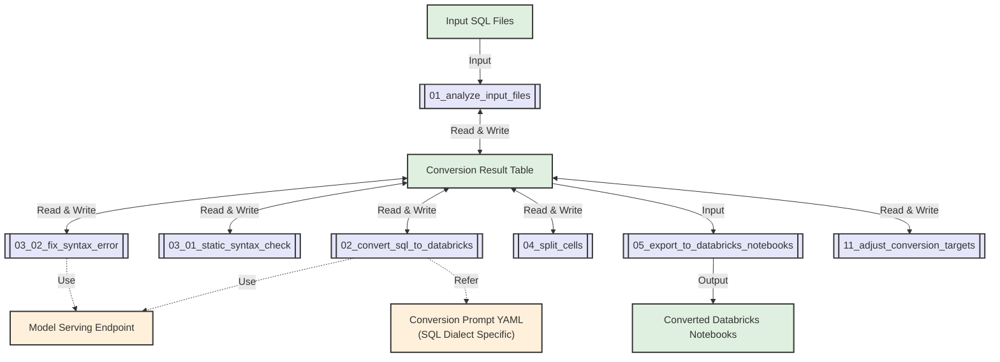

import CodeBlock from '@theme/CodeBlock';

**Switch** is a Lakebridge transpiler plugin that takes a fundamentally different approach to SQL conversion by leveraging Large Language Models (LLMs). Instead of using parsing and rule-based transformation like traditional transpilers, Switch uses [Mosaic AI Model Serving](https://docs.databricks.com/aws/en/machine-learning/model-serving/) to understand the intent and semantics of SQL code and generate equivalent Databricks notebooks.

Switch's LLM-powered approach is particularly effective for complex stored procedures, business logic, and ETL workflows where understanding context and intent matters more than strict syntactic transformation. While the generated notebooks may require manual adjustments, they provide a valuable starting point for migration to Databricks.

---

## How Switch Works

### LLM-Powered Conversion
Switch uses [Mosaic AI Model Serving](https://docs.databricks.com/aws/en/machine-learning/model-serving/) instead of traditional parsing rules. This enables:

- **Semantic Understanding**: Interprets SQL intent and context, not just syntax
- **Flexible Dialect Support**: Handles proprietary SQL extensions and complex business logic
- **Custom Prompts**: Extensible through YAML-based prompts for specialized requirements

### Built on Databricks Platform
Switch leverages native Databricks services:

- **Jobs API**: Executes as Databricks Jobs for scalable batch processing
- **Delta Tables**: Tracks conversion progress and enables restart capabilities  
- **Model Serving**: Integrates directly with Databricks LLM endpoints
- **Compute Resources**: Processes multiple files in parallel using cluster resources

### Notebook Output
Switch generates **Python notebooks** containing Spark SQL as the primary output, with an experimental **SQL notebook** conversion feature for teams preferring pure SQL workflows.

---

## SQL Dialect Support

Switch includes **built-in sample conversion prompts** for 8 major SQL dialects. You can also create custom conversion prompts to support additional SQL dialects or specialized requirements.

### Built-in Sample Conversion Prompts

| SQL Dialect | Source Systems |
|-------------|----------------|
| **MySQL** | MySQL, MariaDB, Amazon Aurora MySQL |
| **Netezza** | IBM Netezza |
| **Oracle** | Oracle Database, Oracle Exadata |
| **PostgreSQL** | PostgreSQL, Amazon Aurora PostgreSQL |
| **Redshift** | Amazon Redshift |
| **Snowflake** | Snowflake |
| **Teradata** | Teradata |
| **T-SQL** | Azure Synapse Analytics, Microsoft SQL Server, Azure SQL Database |

### Custom Dialect Support

Switch's LLM-based approach allows you to support additional SQL dialects by creating custom YAML conversion prompts. This makes Switch extensible beyond the built-in dialects listed above.

For details on creating custom prompts, see the [Advanced Usage](#advanced-usage) section.

---

## Installation & Usage

### Installation

Switch integrates with Lakebridge's transpiler ecosystem. To install Switch:

```bash
databricks labs lakebridge install-transpile
```

During installation:

1. **Automatic Setup**: Switch is installed along with other transpilers
2. **Workspace Integration**: A Databricks Job is created in your authenticated workspace  
3. **Notebook Deployment**: Switch processing notebooks are uploaded to the workspace
4. **Dialect Configuration**: You can select a SQL dialect during installation or configure it later

The installation details are saved in the `custom` section in the transpiler configuration file as shown below:
- **macOS/Linux**: `~/.databricks/labs/remorph-transpilers/switch/lib/config.yml` 
- **Windows**: `%USERPROFILE%\.databricks\labs\remorph-transpilers\switch\lib\config.yml`

### Basic CLI Usage

Switch uses the standard Lakebridge transpile command. To specify Switch as your transpiler, use the `--transpiler-config-path` parameter:

```bash
# Basic Switch usage
databricks labs lakebridge transpile \
  --transpiler-config-path ~/.databricks/labs/remorph-transpilers/switch/lib/config.yml \
  --input-source /Workspace/Shared/migration/sql \
  --output-folder /Workspace/Shared/migration/notebooks \
  --source-dialect snowflake \
  --catalog-name migration_catalog \
  --schema-name switch_results
```

Switch requires **workspace-based paths** and executes as Databricks Jobs rather than local processing. By default, Switch runs **asynchronously** and returns a job URL for monitoring. You can configure it to wait for completion by updating the `wait_for_completion` setting.

### CLI Parameters

The `transpile` command supports these parameters when using Switch:

#### Required Parameters
- `--transpiler-config-path` - Path to Switch configuration file (identifies Switch as the transpiler)
- `--input-source` - Workspace path containing SQL files to convert
- `--output-folder` - Workspace path where generated notebooks will be saved
- `--source-dialect` - SQL dialect of input files: `mysql`, `netezza`, `oracle`, `postgresql`, `redshift`, `snowflake`, `teradata`, `tsql` (defaults to configuration file setting)
- `--catalog-name` - Databricks catalog for conversion state tables (default: `remorph`). Must already exist in your workspace.
- `--schema-name` - Databricks schema for conversion state tables (default: `transpiler`). Must already exist within the specified catalog.

**Permission Requirements**: The executing user must have `CREATE TABLE` permissions on the specified catalog and schema, as Switch creates Delta tables to track conversion progress and store intermediate results.

#### Advanced Configuration

Switch provides detailed configuration options that can be set during installation or by editing the `config.yml` file directly:

| Parameter | Description | Default Value | Available Options |
|-----------|-------------|---------------|-------------------|
| `endpoint_name` | Model serving endpoint name | `databricks-claude-sonnet-4` | Any valid endpoint name |
| `token_count_threshold` | Maximum tokens per file for processing | `20000` | Any positive integer |
| `concurrency` | Number of parallel LLM requests | `4` | Any positive integer |
| `comment_lang` | Language for generated comments | `English` | `English`, `Japanese`, `Chinese`, `Spanish`, `French`, `German` |
| `max_fix_attempts` | Maximum syntax error fix attempts | `1` | Any positive integer |
| `log_level` | Logging verbosity level | `INFO` | `DEBUG`, `INFO`, `WARNING`, `ERROR` |
| `conversion_prompt_yaml` | Custom conversion prompt YAML file path | `<none>` | Full workspace path to YAML file |
| `existing_result_table` | Existing result table to reuse | `<none>` | Full table name (`catalog.schema.table`) |
| `sql_output_dir` | (Experimental) Directory for SQL notebooks | `<none>` | Full workspace path |
| `wait_for_completion` | Wait for job completion (synchronous mode) | `false` | `true`, `false` |

**Configuration Methods**:
1. **During Installation**: Configure options when running `databricks labs lakebridge install-transpile`
2. **Direct File Edit**: Modify the `config.yml` file at the installation path and execute `databricks labs lakebridge transpile`

### Job Monitoring

After executing the transpile command, Switch runs **asynchronously by default** and returns job execution details in JSON format:

```json
{
  "transpiler": "switch",
  "job_id": 12345,
  "run_id": 67890,
  "run_url": "https://your-workspace.databricks.com/#job/12345/run/67890"
}
```

Access the `run_url` to monitor job progress in your Databricks workspace.

**Job Execution Modes**:
- **Asynchronous (default)**: Command returns immediately with monitoring URL
- **Synchronous**: Set `wait_for_completion: true` in transpiler config to wait for job completion

---

## Use Cases

### When to Use Switch

Switch's LLM-based approach makes it particularly suitable for:
- **Complex stored procedures and ETL logic** where understanding business intent is crucial
- **SQL dialects not yet covered by other transpilers** — Switch allows you to add support through custom YAML prompts

### When to Use Other Transpilers

Morpheus and BladeBridge are particularly suitable for:
- **Interactive conversion** with immediate processing
- **Deterministic output requirements** with guaranteed syntax equivalence
- **High-volume processing** with faster throughput than Switch

Choose the approach based on your project's complexity, accuracy requirements, and processing time constraints.

### Success Patterns

#### Effective Switch Usage:
1. **Start Small**: Begin with representative sample files
2. **Iterate Prompts**: Refine YAML prompts based on initial results  
3. **Review and Refine**: Treat Switch output as a good foundation and starting point
4. **Document Patterns**: Capture successful prompt patterns for reuse

---

## Databricks Implementation Details

When you run Switch via the CLI, it executes as Databricks Jobs using a sophisticated multi-stage processing pipeline. This section covers the internal architecture and configuration options.

### Processing Architecture

Switch implements a 6-stage conversion pipeline through specialized Databricks notebooks:

| Stage | Notebook | Purpose |
|-------|----------|---------|
| **1** | `01_analyze_input_files` | Analyzes input SQL files, calculates token counts, saves results to Delta table |
| **2** | `02_convert_sql_to_databricks` | Converts SQL to Python/Spark using LLM, updates result table |  
| **3** | `03_01_static_syntax_check` | Performs syntax validation on generated Python and embedded SQL |
| **4** | `03_02_fix_syntax_error` | Automatically fixes syntax errors using LLM |
| **5** | `04_split_cells` | Organizes code into logical notebook cells |
| **6** | `05_export_to_databricks_notebooks` | Creates final Databricks notebooks |

#### Optional Processing

- **`06_convert_to_sql_notebooks`** (Experimental) - Generates SQL notebook format
- **`11_adjust_conversion_targets`** - Allows reprocessing specific files

### Conversion Flow



### State Management

Switch uses Delta tables for robust state management:

- **Progress Tracking**: Records conversion status for each input file
- **Restart Capability**: Failed jobs can resume from last successful stage
- **Metrics Collection**: Detailed token usage and processing time data
- **Error Tracking**: Comprehensive error logging for debugging

### Notebook-Level Configuration

While CLI parameters control basic settings, Switch notebooks accept detailed configuration:

#### Core Processing Parameters

| Parameter | Description | Default |
|-----------|-------------|---------|
| `input_dir` | Directory containing SQL files | From CLI `--input-source` |
| `endpoint_name` | Model serving endpoint | `databricks-claude-3-7-sonnet` |
| `result_catalog` | Catalog for tracking tables | From CLI `--catalog-name` |
| `result_schema` | Schema for tracking tables | From CLI `--schema-name` |
| `token_count_threshold` | Max tokens per file | `20000` |

#### LLM Processing Settings

| Parameter | Description | Default |  
|-----------|-------------|---------|
| `sql_dialect` | Input SQL dialect | From CLI `--source-dialect` |
| `comment_lang` | Generated comment language | `English` |
| `concurrency` | Parallel LLM requests | `4` |
| `request_params` | LLM request parameters (JSON) | `{}` |

#### Conversion Result Table

Switch creates Delta tables with this schema:

| Column | Type | Purpose |
|--------|------|---------|
| `input_file_number` | int | Unique file identifier |
| `input_file_path` | string | Source file path |
| `input_file_token_count_without_sql_comments` | int | Processed token count |
| `is_conversion_target` | boolean | Whether file should be processed |
| `result_content` | string | Generated notebook content |
| `result_total_tokens` | int | LLM tokens consumed |
| `result_timestamp` | timestamp | Processing completion time |
| `result_error` | string | Any errors encountered |

**Table Naming**: `{catalog}.{schema}.conversion_targets_{YYYYMMDDHHmm}`

### Model Requirements

#### Supported LLM Endpoints

**Primary Recommendation**:
- **Claude 3.7 Sonnet** (`databricks-claude-3-7-sonnet`) - Best performance for complex SQL
- **Extended Thinking Mode**: Enable with `{"max_tokens": 64000, "thinking": {"type": "enabled", "budget_tokens": 16000}}`

**Azure Alternatives**:
- **Azure OpenAI o1** (2024-12-17) - 200K context, 100K output  
- **Azure OpenAI o3-mini** (2025-01-31) - 200K context, 100K output

**Other Compatible Models**:
- Claude 3.5 Sonnet, GPT-4o, Llama 3.3 70B Instruct

#### Token Management

- **Threshold Logic**: Files exceeding `token_count_threshold` are skipped
- **Token Counting**: Performed after removing SQL comments and whitespace
- **Recommended Limits**: 
  - Normal mode: 20,000 tokens
  - Extended thinking: 8,000 tokens

### Infrastructure Requirements  

#### Databricks Permissions

Switch requires the following permissions for the executing user:

**Workspace Permissions**:
- **Read/Write Access**: To specified input and output workspace paths
- **Job Management**: `CAN_MANAGE` or `CAN_VIEW` permissions on created Switch jobs

**Catalog and Schema Permissions**:
- **Catalog Access**: `USE CATALOG` permission on the specified catalog (default: `remorph`)
- **Schema Access**: `USE SCHEMA` permission on the specified schema (default: `transpiler`)
- **Table Creation**: `CREATE TABLE` permission to create conversion tracking Delta tables
- **Table Management**: `SELECT`, `INSERT`, `UPDATE` permissions on tracking tables for state management

**Model Serving Permissions**:
- **Endpoint Access**: Permission to query the configured LLM model serving endpoint
- **Token Usage**: Adequate token quota for your model serving endpoint

**Important**: Both the catalog and schema must **already exist** before running Switch. Switch will not create catalogs or schemas automatically.

#### Compute Resources
- **Cluster Types**: Serverless or classic compute clusters
- **Recommended**: Single-node clusters (Photon not required)
- **Runtime**: DBR 14.3 LTS or 15.3 LTS verified

---

## Advanced Usage

### Customizable Prompts

Switch supports creating custom conversion prompts for new SQL dialects or specialized conversion requirements.

#### Default YAML Files by Dialect

Switch provides built-in YAML configuration files for each supported SQL dialect:

| SQL Dialect | Source System Example | Default YAML File |
|-------------|----------------------|-------------------|
| `mysql` | MySQL / MariaDB / Amazon Aurora MySQL | `mysql_to_databricks_notebook.yml` |
| `netezza` | IBM Netezza | `netezza_to_databricks_notebook.yml` |
| `oracle` | Oracle Database / Oracle Exadata | `oracle_to_databricks_notebook.yml` |
| `postgresql` | PostgreSQL / Amazon Aurora PostgreSQL | `postgresql_to_databricks_notebook.yml` |
| `redshift` | Amazon Redshift | `redshift_to_databricks_notebook.yml` |
| `snowflake` | Snowflake | `snowflake_to_databricks_notebook.yml` |
| `teradata` | Teradata | `teradata_to_databricks_notebook.yml` |
| `tsql` | Azure Synapse Analytics / Microsoft SQL Server / Azure SQL Database | `tsql_to_databricks_notebook.yml` |

#### Creating Custom Conversion Prompts

To create a custom conversion prompt:

1. **Create a YAML file** with the required structure
2. **Place it in your Databricks workspace**
3. **Specify the full path** in the `conversion_prompt_yaml` parameter

Custom conversion prompts require two main sections:

##### Required Structure

```yaml
system_message: |
  Convert SQL code to Python code that runs on Databricks according to the following instructions:

  # Input and Output
  - Input: A single SQL file containing one or multiple T-SQL statements
  - Output: Python code with Python comments (in {comment_lang}) explaining the code

  ${common_python_instructions_and_guidelines}

  # Additional Instructions
  1. Convert SQL queries to spark.sql() format
  2. Add clear Python comments explaining the code
  3. Use DataFrame operations instead of loops when possible
  4. Handle errors using try-except blocks

few_shots:
- role: user
  content: |
    SELECT name, age
    FROM users
    WHERE active = 1;
- role: assistant
  content: |
    # Get names and ages of active users
    active_users = spark.sql("""
        SELECT name, age
        FROM users
        WHERE active = 1
    """)
    display(active_users)
```

##### Key Elements

**`system_message` Section**:
- Clear explanation of the conversion purpose
- Definition of input and output formats
- Additional instructions for specific conversions
- Comment language specification (`{comment_lang}` is automatically replaced)
- Reference to common instructions (`${common_python_instructions_and_guidelines}`)

**`few_shots` Section** (Optional but recommended):
- Include examples ranging from simple to complex cases
- Each example demonstrates specific patterns for LLM understanding
- Shows typical conversion patterns for your SQL dialect

#### Best Practices for Custom Prompts

1. **Start with existing YAML files** as templates for your custom dialects
2. **Include specific dialect features** that differ from standard SQL
3. **Provide comprehensive examples** covering edge cases in your SQL dialect
4. **Test thoroughly** with representative SQL files before large-scale usage
5. **Iterate and refine** based on conversion results

### Multi-Language Comments
- Generate comments in various languages
- Preserves original documentation intent
- Configurable via `--comment-lang`

### Experimental SQL Notebooks
- Optional conversion to SQL notebook format
- Maintains Spark SQL compatibility
- Enable with `--sql-output-dir`

### Troubleshooting and Best Practices

#### Re-converting Specific Files

If conversion results are not satisfactory, you can re-convert specific files:

1. **Mark files for re-conversion**: Use the `11_adjust_conversion_targets` notebook to set the `is_conversion_target` field to `True` for files you want to re-convert
2. **Re-run conversion**: Execute the `02_convert_sql_to_databricks` notebook and subsequent processes. Only files marked as `is_conversion_target` with `True` will be re-converted
3. **Add randomness**: To get different results on each run, set the `temperature` in `request_params` to above 0.5 (if supported by your model)

#### Common Issues and Solutions

##### Files Not Converting (Status: "Not converted")

**Cause**: Input files exceed the token count threshold
**Solutions**:
- Split large input files into smaller, more manageable parts
- Increase the `token_count_threshold` parameter if your LLM model can handle larger inputs
- Consider using extended thinking mode for Claude 3.7 Sonnet with reduced threshold (8,000 tokens)

##### Conversion with Errors (Status: "Converted with errors")

**Cause**: Files were converted but contain syntax errors
**Solutions**:
- Review syntax error messages at the bottom of output notebooks
- Manually fix errors in the converted notebooks
- Increase `max_fix_attempts` for more automatic error correction attempts
- Verify your model serving endpoint supports the required features

##### Export Failures (Status: "Not exported")

**Cause**: Converted content exceeds 10MB size limit
**Solutions**:
- Review and reduce the size of input SQL files
- Split complex procedures into multiple smaller files
- Check for excessive code generation or repetitive patterns

#### Token Management Best Practices

##### Understanding Token Counting

- Token count is calculated **after** removing SQL comments and extra whitespace
- Generated notebooks typically contain more tokens than input SQL due to:
  - Added comments and documentation
  - Code formatting and indentation
  - Python wrapper code around SQL statements

##### Recommended Thresholds by Model

| Model | Recommended `token_count_threshold` | Notes |
|-------|-----------------------------------|-------|
| Claude 3.7 Sonnet (Normal) | 20,000 tokens | Default value, tested up to 60,000 tokens |
| Claude 3.7 Sonnet (Extended Thinking) | 8,000 tokens | Higher values may result in errors |
| Other models (o1, o3-mini, etc.) | ~20,000 tokens | Test in your environment for optimal values |

##### File Size Management

- For files exceeding token limits, consider logical splitting points:
  - Separate stored procedures into individual files
  - Split by functional modules or business domains
  - Maintain referential integrity across split files

#### Performance Optimization

##### Concurrency Settings

- Default `concurrency` of 4 works well for most use cases
- Increase concurrency for faster processing (model endpoint permitting)
- Monitor model serving endpoint for rate limiting or throttling

##### Model Selection Strategy

1. **Start with Claude 3.7 Sonnet** (Foundation Model API) for easiest setup
2. **Use Extended Thinking Mode** for complex stored procedures and business logic
3. **Consider Azure alternatives** only if organizational policies require them
4. **Test token thresholds** in your specific environment before large-scale conversions
