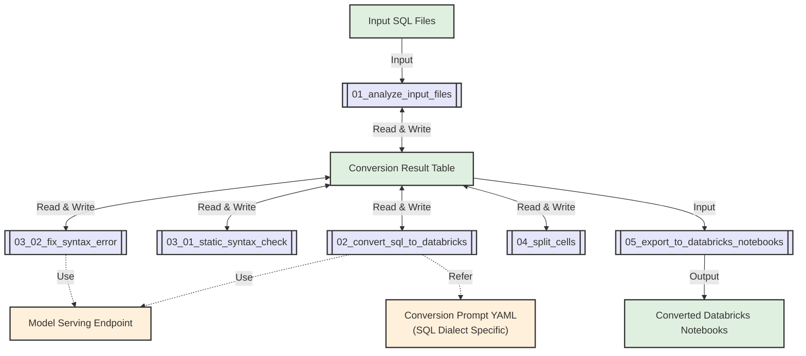

import CodeBlock from '@theme/CodeBlock';

**Switch** is a Lakebridge transpiler plugin that uses Large Language Models (LLMs) to convert SQL and other source formats into Databricks notebooks or generic files. Switch leverages [Mosaic AI Model Serving](https://docs.databricks.com/aws/en/machine-learning/model-serving/) to understand code intent and semantics, generating equivalent Python notebooks with Spark SQL or other target formats.

This LLM-powered approach excels at converting complex stored procedures, business logic, and ETL workflows where context and intent matter more than syntactic transformation. While generated notebooks may require manual adjustments, they provide a valuable foundation for Databricks migration.

---

## How Switch Works

Switch operates through three key components that distinguish it from rule-based transpilers:

### LLM-Powered Semantic Understanding
Instead of parsing rules, Switch uses [Mosaic AI Model Serving](https://docs.databricks.com/aws/en/machine-learning/model-serving/) to:
- Interpret code intent and business context beyond syntax
- Handle SQL dialects, programming languages, and workflow definitions
- Support complex logic patterns and proprietary extensions
- Enable extensible conversion through custom YAML prompts

### Native Databricks Integration
Switch runs entirely within the Databricks platform:
- **Jobs API**: Executes as scalable Databricks Jobs for batch processing
- **Delta Tables**: Tracks conversion progress and results
- **Model Serving**: Direct integration with Databricks LLM endpoints
- **Parallel Processing**: Concurrent model serving endpoint calls for multiple files

### Flexible Output Formats
- **Notebooks**: Python notebooks containing Spark SQL (primary output)
- **Generic Files**: YAML workflows, JSON configurations, and other text formats
- **Experimental**: Additional SQL notebook output converted from generated Python notebooks

---

## Prerequisites & Requirements

Before installing and using Switch, ensure your Databricks environment meets these requirements:

### Databricks Workspace Setup

**Job Execution Environment**
- **Job Creation Permission**: Ability to create and manage Databricks Jobs
  - A Switch job is automatically created during `install-transpile` execution
- **Compute Access**: Switch creates jobs using serverless job compute by default
  - If serverless is unavailable, you can modify job configuration in the Databricks workspace to use classic job compute

**Data Storage Requirements**
- **Catalog Access**: Existing catalog for Switch state management tables
  - Unity Catalog catalogs (recommended) or Hive metastore catalogs supported
- **Schema Access**: Existing schema within the specified catalog
- **Table Creation Permission**: `CREATE TABLE` rights on the catalog and schema
  - Switch creates Delta tables for conversion state and intermediate results
  - Table naming: `lakebridge_switch_{yyyyMMddHHmm}` (e.g., `lakebridge_switch_202501151430`)

### Model Serving Access

Switch uses Foundation Model APIs (like Claude) by default, with options for external model endpoints:

- **Default Setup**: Uses Foundation Model API endpoints - no additional configuration required
- **Permissions Required**: Query access to the model serving endpoint being used
- **Token Quota**: Ensure sufficient quota is available for your conversion workload
- **Custom Options**: Optionally configure external model endpoints or Provisioned Throughput for higher capacity

### Databricks Runtime (for Classic Job Compute)
- **Default**: Serverless job compute (no runtime configuration required)
- **Classic Job Compute**: If using classic clusters instead of serverless:
  - **Verified Versions**: DBR 14.3 LTS or 15.3 LTS (higher versions likely compatible)
  - **Compute Type**: Single-node clusters recommended (Photon not required)

---

## Source Format Support

Switch supports multiple source formats and provides built-in conversion prompts for various use cases.

**Usage**: Specify the conversion type using the `--source-dialect` parameter with one of the values listed below.

### SQL Sources (Default)

Convert SQL from various dialects to Databricks Python notebooks with automatic comment removal and whitespace normalization.

#### Built-in SQL Dialect Prompts

| --source-dialect Value | Source Systems | Example Source Systems |
|--------------|----------------|------------------------|
| `mysql` | MySQL, MariaDB | Amazon Aurora MySQL, RDS, Google Cloud SQL |
| `snowflake` | Snowflake | Snowflake data warehouse |
| `oracle` | Oracle Database | Oracle Database, Exadata, Amazon RDS for Oracle |
| `postgresql` | PostgreSQL | Amazon Aurora PostgreSQL, RDS, Google Cloud SQL |
| `redshift` | Amazon Redshift | Amazon Redshift data warehouse |
| `teradata` | Teradata | Teradata data warehouse |
| `netezza` | IBM Netezza | IBM Netezza data warehouse appliance |
| `tsql` | Microsoft SQL Server | Azure SQL Database, Azure Synapse Analytics, Amazon RDS for SQL Server |

### Generic Sources

Convert non-SQL files to notebooks or other formats without preprocessing.

#### Built-in Generic Prompts

| --source-dialect Value | Source → Target |
|--------------|-----------------|
| `python` | Python Script → Databricks Python Notebook |
| `scala` | Scala Code → Databricks Python Notebook |
| `airflow` | Airflow DAG → Databricks Jobs YAML |

### Latest Built-in Prompts

For the most current and complete list of built-in prompts, see the [databricks-switch-plugin](https://pypi.org/project/databricks-switch-plugin/) package on PyPI, as new conversion types are added regularly.

### Custom Prompt Support

Switch's LLM-based architecture supports additional conversion types through custom YAML conversion prompts, making it extensible beyond built-in options.

For custom prompt creation, see the [Customizable Prompts](#customizable-prompts) section.

---

## Installation & Usage

### Installation

Switch integrates with the Lakebridge transpiler ecosystem:

```bash
databricks labs lakebridge install-transpile
```

The installation automatically:

1. **Installs Switch**: Alongside other transpilers
2. **Creates Databricks Job**: In your authenticated workspace  
3. **Uploads Notebooks**: Switch processing notebooks to workspace

Configuration is saved to:
- **macOS/Linux**: `~/.databricks/labs/remorph-transpilers/switch/lib/config.yml`
- **Windows**: `%USERPROFILE%\.databricks\labs\remorph-transpilers\switch\lib\config.yml`

### CLI Usage

Use the following command to run Switch. Specifying the Switch config file with `--transpiler-config-path` tells Lakebridge to use Switch as the transpiler. Add `--output json` for structured output with job monitoring details:

```bash
# Switch usage - SQL to notebooks conversion
databricks labs lakebridge transpile \
  --transpiler-config-path ~/.databricks/labs/remorph-transpilers/switch/lib/config.yml \
  --input-source /Workspace/path/to/sql \
  --output-folder /Workspace/path/to/notebooks \
  --source-dialect snowflake \
  --catalog-name your_existing_catalog \
  --schema-name your_existing_schema \
  --output json
```

When executing the above command, the response will look like this:

```json
{
  "transpiler": "switch",
  "job_id": 12345,
  "run_id": 67890,
  "run_url": "https://your-workspace.databricks.com/#job/12345/run/67890"
}
```

For advanced configuration and conversion options (non-SQL sources, file outputs, etc.), see the [Advanced Configuration](#advanced-configuration) section below.

#### Operational Notes

Switch operates differently from other Lakebridge transpilers:

- **Databricks Workspace Paths Required**: Input and output paths must be workspace paths (e.g., `/Workspace/path/to/...`) rather than local file paths
- **Jobs API Execution**: Switch runs as a Databricks Job in your workspace, not as a local process
- **Asynchronous by Default**: The command returns immediately with a job URL, allowing you to monitor progress in the Databricks workspace
- **Monitoring**: Use the returned job URL to track conversion progress and view logs

### CLI Parameters

#### Required Parameters
- `--transpiler-config-path` - Local path to Switch configuration file (identifies Switch as the transpiler)
- `--input-source` - Databricks workspace path(s) containing files to convert (see Input Source Patterns below)
- `--output-folder` - Databricks workspace path for generated outputs
- `--source-dialect` - Conversion type to use. Choose from:
  - **SQL Dialects**: `mysql`, `snowflake`, `oracle`, `postgresql`, `redshift`, `teradata`, `netezza`, `tsql`
  - **Generic sources**: `python`, `scala`, `airflow`
- `--catalog-name` - Databricks catalog for state tables. Must already exist.
- `--schema-name` - Databricks schema for state tables. Must already exist.
  - Note: The user must have `CREATE TABLE` permissions on the specified catalog and schema for Switch's state management and intermediate result tables.

#### Input Source Patterns

The `--input-source` parameter supports flexible path specifications:

| Pattern Type | Example | Description |
|-------------|---------|-------------|
| **Single Directory** | `/Workspace/path/to/sql` | Process all files in specified directory recursively |
| **Multiple Directories** | `/Workspace/project1/sql,/Workspace/project2/sql` | Process files from multiple directories recursively (comma-separated) |
| **Glob Patterns** | `/Workspace/Users/*/sql/*.sql` | Use wildcards to match paths (`*` = any characters, `**` = recursive) |
| **Mixed Patterns** | `/Workspace/prod/**/*.sql,/Workspace/dev/sql` | Combine different pattern types |

### Advanced Configuration

Switch provides detailed configuration options that can be set by editing the `config.yml` file:

| Parameter | Description | Default Value | Available Options |
|-----------|-------------|---------------|-------------------|
| `endpoint_name` | Model serving endpoint name | `databricks-claude-sonnet-4` | Any valid endpoint name |
| `token_count_threshold` | Maximum tokens per file for processing | `20000` | Any positive integer |
| `concurrency` | Number of parallel LLM requests | `4` | Any positive integer |
| `comment_lang` | Language for generated comments | `English` | `English`, `Japanese`, `Chinese`, `French`, `German`, `Italian`, `Korean`, `Portuguese`, `Spanish` |
| `max_fix_attempts` | Maximum syntax error fix attempts | `1` | Any positive integer |
| `log_level` | Logging verbosity level | `INFO` | `DEBUG`, `INFO`, `WARNING`, `ERROR` |
| `source_format` | Source file format type. `sql` performs SQL comment removal and whitespace compression preprocessing. `generic` processes files as-is without preprocessing. | `sql` | `sql`, `generic` |
| `target_type` | Output format type | `notebook` | `notebook`, `file` |
| `output_extension` | File extension for file output | `<none>` | Any extension (e.g., `.yml`, `.json`, `.xml`) |
| `conversion_prompt_yaml` | Custom conversion prompt YAML file path. When specified, this custom prompt is used instead of the built-in prompt for the selected `--source-dialect` | `<none>` | Full workspace path to YAML file |
| `request_params` | Additional request parameters for model serving endpoint (JSON format) | `<none>` | JSON string (e.g., `{"max_tokens": 64000}`) |
| `sql_output_dir` | (Experimental) Directory for SQL notebooks | `<none>` | Full workspace path |
| `wait_for_completion` | Wait for job completion. `true`=waits until job finishes, `false`=returns immediately with job URL | `false` | `true`, `false` |

**Configuration Method**:
Modify `default:` values in the `config.yml` file and then execute `databricks labs lakebridge transpile`

**Example config.yml modification**:
```yaml
- flag: comment_lang
  default: "Japanese"     # Change from default "English" to "Japanese"
```

**Configuration for specific use cases**:
- **Python script → Databricks Python notebook**: Set `source_format: "generic"`
- **Airflow → Databricks Jobs YAML**: Set `source_format: "generic"`, `target_type: "file"`, `output_extension: ".yml"`

---

## Use Cases

### When to Use Switch

Switch's LLM-based approach makes it particularly suitable for:
- **Complex code and workflow conversions** where understanding business intent and context is crucial
- **Source formats not yet covered by other transpilers** — Switch allows you to add support through custom YAML prompts

### When to Use Other Transpilers

Morpheus and BladeBridge are particularly suitable for:
- **Interactive conversion** with immediate processing
- **Deterministic output requirements** with guaranteed syntax equivalence
- **High-volume processing** with faster processing (no LLM API calls required)

Choose the approach based on your project's complexity, accuracy requirements, and processing time constraints.

### Success Patterns

#### Effective Switch Usage:
1. **Start Small**: Begin with representative sample files
2. **Iterate Prompts**: Refine YAML prompts based on initial results  
3. **Review and Refine**: Treat output as a solid foundation requiring refinement
4. **Document Patterns**: Capture successful prompt patterns for reuse

---

## Databricks Implementation Details

When you run Switch via the CLI, it executes as Databricks Jobs using a sophisticated multi-stage processing pipeline. This section covers the internal architecture and configuration options.

### Processing Architecture

Switch executes as a Databricks Job that runs the main orchestration notebook (`00_main`), which coordinates a 6-stage conversion pipeline:

#### Main Orchestration
The **`00_main`** notebook serves as the entry point when Switch is executed via Databricks Jobs API. It:
- Validates all input parameters from the job configuration
- Executes each processing stage in sequence using `dbutils.notebook.run()`
- Tracks overall progress and handles stage-level failures
- Displays final conversion results and status in the job output

#### Conversion Flow



The conversion pipeline consists of 6 core stages plus 1 optional stage, each implemented as a separate Databricks notebook. The following sections provide detailed explanations of each processing stage shown in the flow above.

##### Stage 1: File Analysis
The pipeline begins by scanning your input directory for SQL files. It removes SQL comments to get accurate token counts using model-specific tokenizers (Claude uses ~3.4 characters per token, OpenAI uses tiktoken). Files exceeding the `token_count_threshold` are excluded from conversion. All metadata is stored in a timestamped Delta table for tracking.

##### Stage 2: SQL Conversion
The system loads dialect-specific YAML prompts (or your custom prompt) and sends SQL content to the configured model serving endpoint. Multiple files are processed concurrently (default: 4) for efficiency. The LLM transforms SQL code into Python code with `spark.sql()` calls, preserving business logic while adapting to Databricks patterns.

##### Stage 3: Syntax Validation
Before proceeding, all generated code undergoes rigorous validation. Python syntax is checked using `ast.parse()`, while SQL statements within `spark.sql()` calls are validated using Spark's `EXPLAIN` command. Any errors are recorded in the result table without modifying the code.

##### Stage 4: Error Correction
If syntax errors are detected, this stage attempts automatic fixes. It sends the error context back to the LLM, which suggests corrections. The process repeats up to `max_fix_attempts` times (default: 1). This stage only runs when errors exist from the previous validation.

##### Stage 5: Cell Organization
Raw converted code is transformed into a well-structured notebook. The system analyzes code flow and dependencies, splitting at logical boundaries like imports, function definitions, and major SQL operations. Markdown cells are added for documentation and readability.

##### Stage 6: Notebook Export
The final stage creates Databricks-compatible `.py` notebooks in your output directory. Each notebook includes metadata, source file references, and any syntax check results as comments. The system handles files up to 10MB and preserves your directory structure.

##### Stage 7: SQL Notebook Conversion (Optional)
When `sql_output_dir` is specified, this experimental stage uses the model serving endpoint to convert Python notebooks into SQL notebook format with Databricks SQL syntax. This is useful for teams preferring SQL-only workflows, though some Python logic may be lost in translation.

### Parameter Mapping

When Switch executes as a Databricks Job, CLI parameters are mapped to notebook parameters:

| CLI Parameter | Notebook Parameter | Description |
|---------------|-------------------|-------------|
| `--input-source` | `input_dir` | Path(s) containing files to convert (supports patterns) |
| `--output-folder` | `output_dir` | Directory for generated outputs |
| `--catalog-name` | `result_catalog` | Catalog for tracking tables |
| `--schema-name` | `result_schema` | Schema for tracking tables |
| `--source-dialect` | `builtin_prompt` | Built-in conversion prompt (mapped internally) |
| `--transpiler-config-path` | (config file) | Loads additional parameters from Switch config |

Additional parameters are configured through the Switch config file (see the [Advanced Configuration](#advanced-configuration) section above).

### State Management

Switch uses a Delta table to track conversion progress and results. Each conversion job creates a timestamped table: `{catalog}.{schema}.lakebridge_switch_{yyyyMMddHHmm}` (e.g., `main.default.lakebridge_switch_202501151430`)

The table stores input file information (path, content, token counts), conversion results (generated notebooks, token usage, processing time), error details when conversions fail, and syntax check results from validation stages. This allows you to monitor which files were processed successfully and investigate any issues that occurred during conversion.

#### Conversion Result Table Schema

Switch creates Delta tables with the following complete schema:

| Column | Type | Description |
|--------|------|-------------|
| `input_file_number` | int | Unique integer identifier for each input file (starts from 1) |
| `input_file_path` | string | Full path to the input file |
| `input_file_encoding` | string | Detected encoding of the input file (e.g., UTF-8) |
| `tokenizer_type` | string | Type of tokenizer used (claude or openai) |
| `tokenizer_model` | string | Specific tokenizer model/encoding used |
| `input_file_token_count` | int | Total number of tokens in the input file |
| `input_file_token_count_preprocessed` | int | Token count of preprocessed content (SQL comments removed for SQL files, original count for generic files) |
| `input_file_content` | string | Entire content of the input file |
| `input_file_content_preprocessed` | string | Preprocessed content (SQL comments removed for SQL files, original content for generic files) |
| `is_conversion_target` | boolean | Whether file should be processed (updated during conversion) |
| `model_serving_endpoint_for_conversion` | string | Model endpoint used for conversion |
| `model_serving_endpoint_for_fix` | string | Model endpoint used for syntax error fixing |
| `request_params_for_conversion` | string | Conversion request parameters in JSON format |
| `request_params_for_fix` | string | Fix request parameters in JSON format |
| `result_content` | string | Generated notebook content (initially null) |
| `result_prompt_tokens` | int | Number of prompt tokens used (initially null) |
| `result_completion_tokens` | int | Number of completion tokens generated (initially null) |
| `result_total_tokens` | int | Total tokens used (prompt + completion, initially null) |
| `result_processing_time_seconds` | float | Processing time in seconds (initially null) |
| `result_timestamp` | timestamp | UTC timestamp when processing completed (initially null) |
| `result_error` | string | Any conversion errors encountered (initially null) |
| `result_python_parse_error` | string | Python syntax errors found using ast.parse |
| `result_extracted_sqls` | array<string> | SQL statements extracted from Python code (initially null) |
| `result_sql_parse_errors` | array<string> | SQL syntax errors found using EXPLAIN (initially null) |
| `source_format` | string | Source format type (sql or generic) |
| `target_type` | string | Output type (notebook or file) |
| `output_extension` | string | File extension for file outputs |
| `builtin_prompt` | string | Built-in prompt used for conversion |

### Model Requirements

#### Supported LLM Endpoints

Switch works with LLMs that have large context windows and strong code comprehension capabilities. Databricks Foundation Model APIs provide the simplest setup, while external models offer additional flexibility for organizational requirements.

**Primary Recommendation**:
Currently, the latest Claude models available through Foundation Model APIs show the best performance for understanding complex code patterns and business logic in SQL-to-notebook conversion.

For complex stored procedures and intricate business logic, Claude's extended thinking mode can significantly improve conversion accuracy. This mode allows the model to reason through complex transformations more thoroughly, though it increases processing time and token usage. To enable extended thinking mode, configure the `request_params` parameter (example values):
```json
{"max_tokens": 64000, "thinking": {"type": "enabled", "budget_tokens": 16000}}
```

Other capable models are also supported through both Foundation Model APIs and external models.

**External Models**:
For organizations with specific requirements (such as Azure-only policies, custom compliance needs, or high-throughput processing), Switch supports external models through external model serving endpoints. External models offer benefits including:
- **Throughput Control**: Configure dedicated capacity for consistent performance
- **Organizational Compliance**: Meet specific cloud or vendor requirements
- **Cost Management**: Optimize costs for large-scale processing
- **Higher Concurrency**: Scale beyond Foundation Model API limitations

**Choosing Between Options**:
- **Foundation Model APIs**: Best for getting started, smaller workloads, and standard use cases
- **External Models**: Recommended for large-scale processing, organizational constraints, or when higher concurrency is needed

#### Token Management

LLMs have limits on how much text they can process at once. Switch uses a simple threshold approach:

**How it works:**
- Stage 1 analyzes each SQL file and counts tokens (after removing comments and compressing multiple spaces into a single space)
- Files with token count ≤ `token_count_threshold` are marked for conversion
- Files exceeding the threshold are skipped with status "Not converted"

**Token counting approach:**
- Claude models: Character-based estimation (~3.4 characters per token)
- Other models: Uses tiktoken library with o200k_base encoding
- Rough guideline: 20,000 tokens ≈ 50,000 single-byte characters

**Recommended approach:**
- Default threshold: 20,000 tokens (example value based on stability testing)
- For complex transformations with extended thinking: Consider lower thresholds (e.g., 8,000 tokens)
- Optimal values may vary by model and environment - test in your specific setup for best results

**Managing large files:**
If your SQL files exceed the threshold, consider logical splitting points:
- Separate stored procedures into individual files
- Split by functional modules or business domains
- Maintain referential integrity across split files

#### Performance Optimization

**Concurrency Settings:**
- **Default concurrency**: Set to 4 to accommodate limitations with some Foundation Model API endpoints
- **Scaling for large workloads**: For processing many files simultaneously, consider:
  - **Provisioned Throughput**: Deploy dedicated Foundation Model API capacity with guaranteed throughput
  - **External Models**: Configure external endpoints with higher rate limits
  - **Increased concurrency**: Adjust the `concurrency` parameter based on endpoint capacity

**Monitoring:**
- Watch for rate limiting or throttling responses from model endpoints
- Consider enabling [Inference Tables](https://docs.databricks.com/aws/en/machine-learning/model-serving/inference-tables) to automatically capture requests and responses for detailed monitoring and debugging

---

## Customizable Prompts

You can create custom conversion prompts for Switch to handle new SQL dialects or specialized conversion requirements.

### Creating Custom Conversion Prompts

To create a custom conversion prompt:

1. **Create a YAML file** with the required structure
2. **Place it in your Databricks workspace**
3. **Specify the full path** in the `conversion_prompt_yaml` parameter

Custom conversion prompts require two main sections:

#### Required Structure

```yaml
system_message: |
  Convert SQL code to Python code that runs on Databricks according to the following instructions:

  # Input and Output
  - Input: A single SQL file containing one or multiple T-SQL statements
  - Output: Python code with Python comments (in {comment_lang}) explaining the code

  ${common_python_instructions_and_guidelines}

  # Additional Instructions
  1. Convert SQL queries to spark.sql() format
  2. Add clear Python comments explaining the code
  3. Use DataFrame operations instead of loops when possible
  4. Handle errors using try-except blocks

few_shots:
- role: user
  content: |
    SELECT name, age
    FROM users
    WHERE active = 1;
- role: assistant
  content: |
    # Get names and ages of active users
    active_users = spark.sql("""
        SELECT name, age
        FROM users
        WHERE active = 1
    """)
    display(active_users)
```

#### Key Elements

**`system_message` Section**:
- Clear explanation of the conversion purpose
- Definition of input and output formats
- Additional instructions for specific conversions
- Comment language specification (`{comment_lang}` will be replaced automatically by Switch)
- Reference to common instructions (`${common_python_instructions_and_guidelines}`)

**`few_shots` Section** (Optional but recommended):
- Include examples ranging from simple to complex cases
- Each example demonstrates specific patterns for LLM understanding
- Shows typical conversion patterns for your SQL dialect

### Best Practices for Custom Prompts

1. **Start with the built-in YAML files** as templates for your custom dialects
2. **Include specific dialect features** that differ from standard SQL
3. **Provide comprehensive examples** covering edge cases in your SQL dialect
4. **Test thoroughly** with representative SQL files before large-scale usage
5. **Iterate and refine** based on conversion results

### Reference: Built-in YAML Files

Switch includes built-in YAML configuration files for each supported SQL dialect. When creating custom prompts, these built-in configurations serve as excellent starting points - even for supported dialects, customizing the default prompts based on your specific input patterns can significantly improve conversion accuracy.

**Location**: You can find example YAML files in the `pyscripts/conversion_prompt_yaml/` directory within the same workspace folder as the main Switch notebook (`00_main`). These files demonstrate the proper structure and provide dialect-specific examples that you can adapt for your custom requirements.

### FAQ: Can Switch Support My Source System?

A common question is whether Switch can handle sources beyond the built-in SQL dialects. The answer is: **try it!**

**For SQL-based sources**: Creating a custom prompt YAML file should work well for most SQL dialects. Since LLMs understand SQL syntax patterns, you can typically achieve good results by:
- Starting with a similar built-in dialect's YAML as a template
- Adding specific syntax examples from your source system
- Testing and iterating based on results

**For non-SQL sources**: Switch's LLM-based architecture means it can potentially handle other code-to-notebook conversions (e.g., converting Python scripts, R code, or other programming languages to Databricks notebooks). Modern LLMs have strong code comprehension capabilities across many programming languages. While these use cases haven't been extensively tested, you can experiment by:
- Creating custom prompts that define your source format
- Providing clear conversion examples in the few-shots section
- Testing with representative code samples

Rather than waiting for additional built-in examples, we encourage experimentation with custom prompts. The flexibility of LLM-based conversion means many use cases are possible with the right prompt engineering.

## Conversion Results and Troubleshooting

### Understanding Conversion Results

After your Switch job completes, review the conversion results displayed at the end of the `00_main` notebook execution. The results table shows the status of each input file:

- **Successfully converted files**: Ready to use as Databricks notebooks
- **Files requiring attention**: May need manual review or re-processing

If you encounter files that didn't convert successfully, here are the most common issues and their solutions:

### Files Not Converting (Status: "Not converted")

These files were skipped during the conversion process, typically because they're too large for the model to process effectively.

**Cause**: Input files exceed the token count threshold

**Solutions**:
- Split large input files into smaller, more manageable parts
- Increase the `token_count_threshold` parameter if your LLM model can handle larger inputs

### Conversion with Errors (Status: "Converted with errors")

These files were successfully processed by the LLM but the generated code contains syntax errors that need to be addressed.

**Cause**: Files were converted but contain syntax errors

**Solutions**:
- Review syntax error messages at the bottom of output notebooks
- Manually fix errors in the converted notebooks
- Increase `max_fix_attempts` for more automatic error correction attempts

### Export Failures (Status: "Not exported")

These files were converted successfully but couldn't be exported as notebooks due to size limitations. This is a rare occurrence that typically only happens with exceptionally large or complex SQL files.

**Cause**: Converted content exceeds 10MB size limit

**Solutions**:
- Check the result table for excessive code generation or repetitive patterns in the LLM output
- Manually split the converted content into multiple notebooks
- Consider splitting the original SQL file into smaller logical units and re-running the conversion
