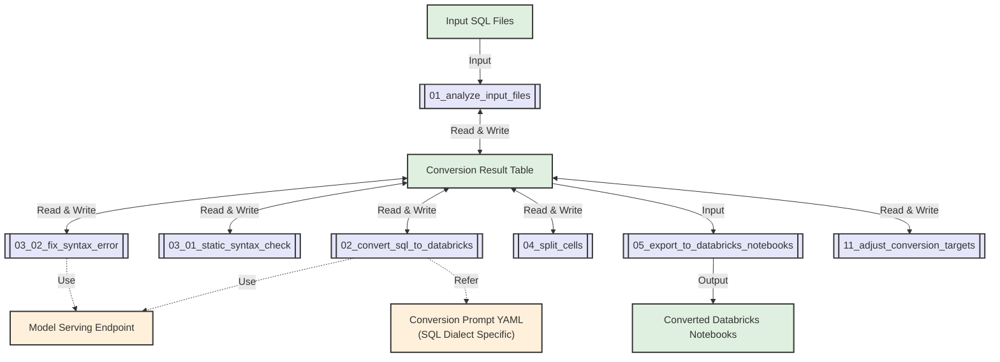

import CodeBlock from '@theme/CodeBlock';

**Switch** is a Lakebridge transpiler plugin that uses Large Language Models (LLMs) to convert SQL code into Databricks notebooks. Switch leverages [Mosaic AI Model Serving](https://docs.databricks.com/aws/en/machine-learning/model-serving/) to understand SQL intent and semantics, generating equivalent Python notebooks with Spark SQL.

This LLM-powered approach excels at converting complex stored procedures, business logic, and ETL workflows where context and intent matter more than syntactic transformation. While generated notebooks may require manual adjustments, they provide a valuable foundation for Databricks migration.

---

## How Switch Works

Switch operates through three key components that distinguish it from rule-based transpilers:

### LLM-Powered Semantic Understanding
Instead of parsing rules, Switch uses [Mosaic AI Model Serving](https://docs.databricks.com/aws/en/machine-learning/model-serving/) to:
- Interpret SQL intent and business context beyond syntax
- Handle proprietary SQL extensions and complex logic patterns
- Support extensible conversion through custom YAML prompts

### Native Databricks Integration
Switch runs entirely within the Databricks platform:
- **Jobs API**: Executes as scalable Databricks Jobs for batch processing
- **Delta Tables**: Tracks conversion progress with restart capabilities  
- **Model Serving**: Direct integration with Databricks LLM endpoints
- **Parallel Processing**: Leverages cluster resources for multiple files

### Flexible Output Formats
- **Primary Output**: Python notebooks containing Spark SQL
- **Experimental**: SQL notebook conversion for pure SQL workflows

---

## Prerequisites & Requirements

Before installing and using Switch, ensure your Databricks environment meets these requirements:

### Databricks Workspace Setup

**Job Execution Environment**
- **Job Creation Permission**: Ability to create and manage Databricks Jobs
  - A Switch job is automatically created during `install-transpile` execution
- **Compute Access**: Switch creates jobs using serverless job compute by default
  - If serverless is unavailable, you can modify job configuration in the Databricks workspace to use classic job compute

**Data Storage Requirements**
- **Catalog Access**: Existing catalog for Switch state management tables
  - Unity Catalog catalogs (recommended) or Hive metastore catalogs supported
  - Default catalog name: `remorph`
- **Schema Access**: Existing schema within the specified catalog
  - Default schema name: `transpiler`
- **Table Creation Permission**: `CREATE TABLE` rights on the catalog and schema
  - Switch creates Delta tables for conversion state and intermediate results

### Model Serving Access

**LLM Endpoint Requirements**
- **Foundation Model API**: Default endpoint is `databricks-claude-sonnet-4`
- **Custom Endpoints**: You can configure custom or external model serving endpoints
- **Token Quota**: Sufficient quota for your conversion workload
- **Permissions**: Query access to the configured model serving endpoint

### Databricks Runtime (for Classic Job Compute)
- **Default**: Serverless job compute (no runtime configuration required)
- **Classic Job Compute**: If using classic clusters instead of serverless:
  - **Verified Versions**: DBR 14.3 LTS or 15.3 LTS (higher versions likely compatible)
  - **Compute Type**: Single-node clusters recommended (Photon not required)

---

## SQL Dialect Support

Switch provides built-in sample conversion prompts for 8 major SQL dialects, with extensibility for custom dialects through YAML configuration.

### Built-in Sample Conversion Prompts

| SQL Dialect | Source Systems |
|-------------|----------------|
| **MySQL** | MySQL, MariaDB, and MySQL-compatible services (including Amazon Aurora MySQL, RDS, Google Cloud SQL) |
| **Netezza** | IBM Netezza |
| **Oracle** | Oracle Database, Oracle Exadata, and Oracle-compatible services (including Amazon RDS) |
| **PostgreSQL** | PostgreSQL and PostgreSQL-compatible services (including Amazon Aurora PostgreSQL, RDS, Google Cloud SQL) |
| **Redshift** | Amazon Redshift |
| **Snowflake** | Snowflake |
| **Teradata** | Teradata |
| **T-SQL** | Microsoft SQL Server, Azure SQL family (Database, Managed Instance, Synapse Analytics), Amazon RDS for SQL Server |

### Custom Dialect Support

Switch's LLM-based architecture supports additional SQL dialects through custom YAML conversion prompts, making it extensible beyond built-in options.

For custom prompt creation, see the [Advanced Usage](#advanced-usage) section.

---

## Installation & Usage

### Installation

Switch integrates with the Lakebridge transpiler ecosystem:

```bash
databricks labs lakebridge install-transpile
```

The installation automatically:

1. **Installs Switch**: Alongside other transpilers
2. **Creates Databricks Job**: In your authenticated workspace  
3. **Uploads Notebooks**: Switch processing notebooks to workspace

Configuration is saved to:
- **macOS/Linux**: `~/.databricks/labs/remorph-transpilers/switch/lib/config.yml`
- **Windows**: `%USERPROFILE%\.databricks\labs\remorph-transpilers\switch\lib\config.yml`

### CLI Usage

Use the following command to run Switch. Specifying the Switch config file with `--transpiler-config-path` tells Lakebridge to use Switch as the transpiler:

```bash
# Switch usage
databricks labs lakebridge transpile \
  --transpiler-config-path ~/.databricks/labs/remorph-transpilers/switch/lib/config.yml \
  --input-source /Workspace/path/to/sql \
  --output-folder /Workspace/path/to/notebooks \
  --source-dialect snowflake \
  --catalog-name your_existing_catalog \
  --schema-name your_existing_schema
```

For advanced configuration options, see [Advanced Configuration](#advanced-configuration) below.

#### Operational Notes

Switch operates differently from other Lakebridge transpilers:

- **Databricks Workspace Paths Required**: Input and output paths must be workspace paths (e.g., `/Workspace/path/to/...`) rather than local file paths
- **Jobs API Execution**: Switch runs as a Databricks Job in your workspace, not as a local process
- **Asynchronous by Default**: The command returns immediately with a job URL, allowing you to monitor progress in the Databricks workspace
- **Monitoring**: Use the returned job URL to track conversion progress and view logs

### CLI Parameters

#### Required Parameters
- `--transpiler-config-path` - Path to Switch configuration file (identifies Switch as the transpiler)
- `--input-source` - Workspace path containing SQL files to convert
- `--output-folder` - Workspace path for generated notebooks
- `--source-dialect` - SQL dialect: `mysql`, `netezza`, `oracle`, `postgresql`, `redshift`, `snowflake`, `teradata`, `tsql`
- `--catalog-name` - Databricks catalog for state tables (default: `remorph`). Must already exist.
- `--schema-name` - Databricks schema for state tables (default: `transpiler`). Must already exist.

**Permission Requirements**: The user must have `CREATE TABLE` permissions on the specified catalog and schema for Switch's state management and intermediate result tables.

#### Advanced Configuration

Switch provides detailed configuration options that can be set during installation or by editing the `config.yml` file directly:

| Parameter | Description | Default Value | Available Options |
|-----------|-------------|---------------|-------------------|
| `endpoint_name` | Model serving endpoint name | `databricks-claude-sonnet-4` | Any valid endpoint name |
| `token_count_threshold` | Maximum tokens per file for processing | `20000` | Any positive integer |
| `concurrency` | Number of parallel LLM requests | `4` | Any positive integer |
| `comment_lang` | Language for generated comments | `English` | `English`, `Japanese`, `Chinese`, `Spanish`, `French`, `German` |
| `max_fix_attempts` | Maximum syntax error fix attempts | `1` | Any positive integer |
| `log_level` | Logging verbosity level | `INFO` | `DEBUG`, `INFO`, `WARNING`, `ERROR` |
| `conversion_prompt_yaml` | Custom conversion prompt YAML file path | `<none>` | Full workspace path to YAML file |
| `existing_result_table` | Existing result table to reuse | `<none>` | Full table name (`catalog.schema.table`) |
| `sql_output_dir` | (Experimental) Directory for SQL notebooks | `<none>` | Full workspace path |
| `wait_for_completion` | Wait for job completion (synchronous mode) | `false` | `true`, `false` |

**Configuration Methods**:
1. **During Installation**: Configure options when running `databricks labs lakebridge install-transpile`
2. **Direct File Edit**: Modify the `config.yml` file at the installation path and then execute `databricks labs lakebridge transpile`

### Job Monitoring

After executing the transpile command, Switch runs **asynchronously by default** and returns job execution details in JSON format:

```json
{
  "transpiler": "switch",
  "job_id": 12345,
  "run_id": 67890,
  "run_url": "https://your-workspace.databricks.com/#job/12345/run/67890"
}
```

Access the `run_url` to monitor job progress in your Databricks workspace.

**Job Execution Modes**:
- **Asynchronous (default)**: Command returns immediately with monitoring URL
- **Synchronous**: Set `wait_for_completion: true` in transpiler config to wait for job completion

---

## Use Cases

### When to Use Switch

Switch's LLM-based approach makes it particularly suitable for:
- **Complex stored procedures and ETL logic** where understanding business intent is crucial
- **SQL dialects not yet covered by other transpilers** — Switch allows you to add support through custom YAML prompts

### When to Use Other Transpilers

Morpheus and BladeBridge are particularly suitable for:
- **Interactive conversion** with immediate processing
- **Deterministic output requirements** with guaranteed syntax equivalence
- **High-volume processing** with faster throughput than Switch

Choose the approach based on your project's complexity, accuracy requirements, and processing time constraints.

### Success Patterns

#### Effective Switch Usage:
1. **Start Small**: Begin with representative sample files
2. **Iterate Prompts**: Refine YAML prompts based on initial results  
3. **Review and Refine**: Treat output as a solid foundation requiring refinement
4. **Document Patterns**: Capture successful prompt patterns for reuse

---

## Databricks Implementation Details

When you run Switch via the CLI, it executes as Databricks Jobs using a sophisticated multi-stage processing pipeline. This section covers the internal architecture and configuration options.

### Processing Architecture

Switch implements a 6-stage conversion pipeline through specialized Databricks notebooks:

| Stage | Notebook | Purpose |
|-------|----------|---------|
| **1** | `01_analyze_input_files` | Analyzes input SQL files, calculates token counts, saves results to Delta table |
| **2** | `02_convert_sql_to_databricks` | Converts SQL to Python/Spark using LLM, updates result table |  
| **3** | `03_01_static_syntax_check` | Performs syntax validation on generated Python and embedded SQL |
| **4** | `03_02_fix_syntax_error` | Automatically fixes syntax errors using LLM |
| **5** | `04_split_cells` | Organizes code into logical notebook cells |
| **6** | `05_export_to_databricks_notebooks` | Creates final Databricks notebooks |

#### Optional Processing

- **`06_convert_to_sql_notebooks`** (Experimental) - Generates SQL notebook format
- **`11_adjust_conversion_targets`** - Allows reprocessing specific files

### Conversion Flow



### State Management

Switch uses Delta tables for robust state management:

- **Progress Tracking**: Records conversion status for each input file
- **Restart Capability**: Failed jobs can resume from last successful stage
- **Metrics Collection**: Detailed token usage and processing time data
- **Error Tracking**: Comprehensive error logging for debugging

### Notebook-Level Configuration

While CLI parameters control basic settings, Switch notebooks accept detailed configuration:

#### Core Processing Parameters

| Parameter | Description | Default |
|-----------|-------------|---------|
| `input_dir` | Directory containing SQL files | From CLI `--input-source` |
| `endpoint_name` | Model serving endpoint | `databricks-claude-3-7-sonnet` |
| `result_catalog` | Catalog for tracking tables | From CLI `--catalog-name` |
| `result_schema` | Schema for tracking tables | From CLI `--schema-name` |
| `token_count_threshold` | Max tokens per file | `20000` |

#### LLM Processing Settings

| Parameter | Description | Default |  
|-----------|-------------|---------|
| `sql_dialect` | Input SQL dialect | From CLI `--source-dialect` |
| `comment_lang` | Generated comment language | `English` |
| `concurrency` | Parallel LLM requests | `4` |
| `request_params` | LLM request parameters (JSON) | `{}` |

#### Conversion Result Table

Switch creates Delta tables with this schema:

| Column | Type | Purpose |
|--------|------|---------|
| `input_file_number` | int | Unique file identifier |
| `input_file_path` | string | Source file path |
| `input_file_token_count_without_sql_comments` | int | Processed token count |
| `is_conversion_target` | boolean | Whether file should be processed |
| `result_content` | string | Generated notebook content |
| `result_total_tokens` | int | LLM tokens consumed |
| `result_timestamp` | timestamp | Processing completion time |
| `result_error` | string | Any errors encountered |

**Table Naming**: `{catalog}.{schema}.conversion_targets_{YYYYMMDDHHmm}`

### Model Requirements

#### Supported LLM Endpoints

**Primary Recommendation**:
- **Claude 3.7 Sonnet** (`databricks-claude-3-7-sonnet`) - Best performance for complex SQL
- **Extended Thinking Mode**: Enable with `{"max_tokens": 64000, "thinking": {"type": "enabled", "budget_tokens": 16000}}`

**Azure Alternatives**:
- **Azure OpenAI o1** (2024-12-17) - 200K context, 100K output  
- **Azure OpenAI o3-mini** (2025-01-31) - 200K context, 100K output

**Other Compatible Models**:
- Claude 3.5 Sonnet, GPT-4o, Llama 3.3 70B Instruct

#### Token Management

- **Threshold Logic**: Files exceeding `token_count_threshold` are skipped
- **Token Counting**: Performed after removing SQL comments and whitespace
- **Recommended Limits**: 
  - Normal mode: 20,000 tokens
  - Extended thinking: 8,000 tokens

### Infrastructure Requirements  

#### Databricks Permissions

Switch requires the following permissions for the executing user:

**Workspace Permissions**:
- **Read/Write Access**: To specified input and output workspace paths
- **Job Management**: `CAN_MANAGE` or `CAN_VIEW` permissions on created Switch jobs

**Catalog and Schema Permissions**:
- **Catalog Access**: `USE CATALOG` permission on the specified catalog (default: `remorph`)
- **Schema Access**: `USE SCHEMA` permission on the specified schema (default: `transpiler`)
- **Table Creation**: `CREATE TABLE` permission to create conversion tracking Delta tables
- **Table Management**: `SELECT`, `INSERT`, `UPDATE` permissions on tracking tables for state management

**Model Serving Permissions**:
- **Endpoint Access**: Permission to query the configured LLM model serving endpoint
- **Token Usage**: Adequate token quota for your model serving endpoint

**Important**: Both the catalog and schema must **already exist** before running Switch. Switch will not create catalogs or schemas automatically.

#### Compute Resources
- **Cluster Types**: Serverless or classic compute clusters
- **Recommended**: Single-node clusters (Photon not required)
- **Runtime**: DBR 14.3 LTS or 15.3 LTS verified

---

## Advanced Usage

### Customizable Prompts

Switch supports creating custom conversion prompts for new SQL dialects or specialized conversion requirements.

#### Default YAML Files by Dialect

Switch provides built-in YAML configuration files for each supported SQL dialect:

| SQL Dialect | Source System Example | Default YAML File |
|-------------|----------------------|-------------------|
| `mysql` | MySQL / MariaDB / Amazon Aurora MySQL | `mysql_to_databricks_notebook.yml` |
| `netezza` | IBM Netezza | `netezza_to_databricks_notebook.yml` |
| `oracle` | Oracle Database / Oracle Exadata | `oracle_to_databricks_notebook.yml` |
| `postgresql` | PostgreSQL / Amazon Aurora PostgreSQL | `postgresql_to_databricks_notebook.yml` |
| `redshift` | Amazon Redshift | `redshift_to_databricks_notebook.yml` |
| `snowflake` | Snowflake | `snowflake_to_databricks_notebook.yml` |
| `teradata` | Teradata | `teradata_to_databricks_notebook.yml` |
| `tsql` | Azure Synapse Analytics / Microsoft SQL Server / Azure SQL Database | `tsql_to_databricks_notebook.yml` |

#### Creating Custom Conversion Prompts

To create a custom conversion prompt:

1. **Create a YAML file** with the required structure
2. **Place it in your Databricks workspace**
3. **Specify the full path** in the `conversion_prompt_yaml` parameter

Custom conversion prompts require two main sections:

##### Required Structure

```yaml
system_message: |
  Convert SQL code to Python code that runs on Databricks according to the following instructions:

  # Input and Output
  - Input: A single SQL file containing one or multiple T-SQL statements
  - Output: Python code with Python comments (in {comment_lang}) explaining the code

  ${common_python_instructions_and_guidelines}

  # Additional Instructions
  1. Convert SQL queries to spark.sql() format
  2. Add clear Python comments explaining the code
  3. Use DataFrame operations instead of loops when possible
  4. Handle errors using try-except blocks

few_shots:
- role: user
  content: |
    SELECT name, age
    FROM users
    WHERE active = 1;
- role: assistant
  content: |
    # Get names and ages of active users
    active_users = spark.sql("""
        SELECT name, age
        FROM users
        WHERE active = 1
    """)
    display(active_users)
```

##### Key Elements

**`system_message` Section**:
- Clear explanation of the conversion purpose
- Definition of input and output formats
- Additional instructions for specific conversions
- Comment language specification (`{comment_lang}` is automatically replaced)
- Reference to common instructions (`${common_python_instructions_and_guidelines}`)

**`few_shots` Section** (Optional but recommended):
- Include examples ranging from simple to complex cases
- Each example demonstrates specific patterns for LLM understanding
- Shows typical conversion patterns for your SQL dialect

#### Best Practices for Custom Prompts

1. **Start with existing YAML files** as templates for your custom dialects
2. **Include specific dialect features** that differ from standard SQL
3. **Provide comprehensive examples** covering edge cases in your SQL dialect
4. **Test thoroughly** with representative SQL files before large-scale usage
5. **Iterate and refine** based on conversion results

### Multi-Language Comments
- Generate comments in various languages
- Preserves original documentation intent
- Configurable via `--comment-lang`

### Experimental SQL Notebooks
- Optional conversion to SQL notebook format
- Maintains Spark SQL compatibility
- Enable with `--sql-output-dir`

### Troubleshooting and Best Practices

#### Re-converting Specific Files

If conversion results are not satisfactory, you can re-convert specific files:

1. **Mark files for re-conversion**: Use the `11_adjust_conversion_targets` notebook to set the `is_conversion_target` field to `True` for files you want to re-convert
2. **Re-run conversion**: Execute the `02_convert_sql_to_databricks` notebook and subsequent processes. Only files marked as `is_conversion_target` with `True` will be re-converted
3. **Add randomness**: To get different results on each run, set the `temperature` in `request_params` to above 0.5 (if supported by your model)

#### Common Issues and Solutions

##### Files Not Converting (Status: "Not converted")

**Cause**: Input files exceed the token count threshold
**Solutions**:
- Split large input files into smaller, more manageable parts
- Increase the `token_count_threshold` parameter if your LLM model can handle larger inputs
- Consider using extended thinking mode for Claude 3.7 Sonnet with reduced threshold (8,000 tokens)

##### Conversion with Errors (Status: "Converted with errors")

**Cause**: Files were converted but contain syntax errors
**Solutions**:
- Review syntax error messages at the bottom of output notebooks
- Manually fix errors in the converted notebooks
- Increase `max_fix_attempts` for more automatic error correction attempts
- Verify your model serving endpoint supports the required features

##### Export Failures (Status: "Not exported")

**Cause**: Converted content exceeds 10MB size limit
**Solutions**:
- Review and reduce the size of input SQL files
- Split complex procedures into multiple smaller files
- Check for excessive code generation or repetitive patterns

#### Token Management Best Practices

##### Understanding Token Counting

- Token count is calculated **after** removing SQL comments and extra whitespace
- Generated notebooks typically contain more tokens than input SQL due to:
  - Added comments and documentation
  - Code formatting and indentation
  - Python wrapper code around SQL statements

##### Recommended Thresholds by Model

| Model | Recommended `token_count_threshold` | Notes |
|-------|-----------------------------------|-------|
| Claude 3.7 Sonnet (Normal) | 20,000 tokens | Default value, tested up to 60,000 tokens |
| Claude 3.7 Sonnet (Extended Thinking) | 8,000 tokens | Higher values may result in errors |
| Other models (o1, o3-mini, etc.) | ~20,000 tokens | Test in your environment for optimal values |

##### File Size Management

- For files exceeding token limits, consider logical splitting points:
  - Separate stored procedures into individual files
  - Split by functional modules or business domains
  - Maintain referential integrity across split files

#### Performance Optimization

##### Concurrency Settings

- Default `concurrency` of 4 works well for most use cases
- Increase concurrency for faster processing (model endpoint permitting)
- Monitor model serving endpoint for rate limiting or throttling

##### Model Selection Strategy

1. **Start with Claude 3.7 Sonnet** (Foundation Model API) for easiest setup
2. **Use Extended Thinking Mode** for complex stored procedures and business logic
3. **Consider Azure alternatives** only if organizational policies require them
4. **Test token thresholds** in your specific environment before large-scale conversions
